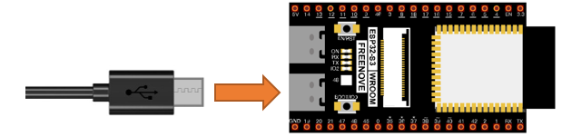
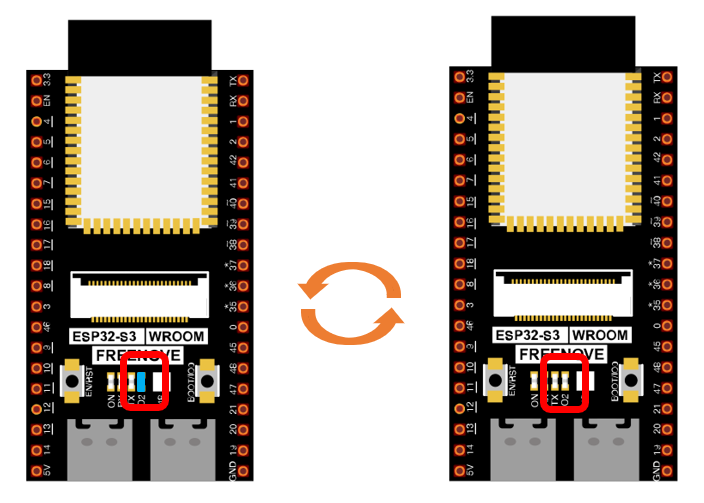
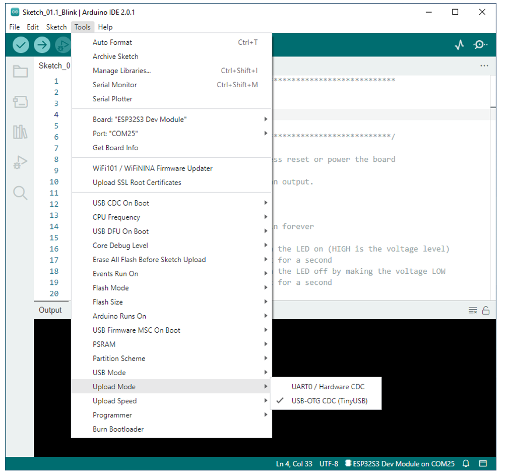

##############################################################################
0. Chapter LED
##############################################################################

This chapter is the Start Point in the journey to build and explore ESP32-S3 WROOM electronic projects. We will start with simple "Blink" project.

Project 0.1 Blink
******************************

In this project, we will use ESP32-S3 WROOM to control blinking a common LED.

Component List
===============================

.. list-table:: 
   :width: 100%
   :header-rows: 1 
   :align: center
   
   * -  ESP32-S3 WROOM x1
     -  USB cable x1

   * -  |Chapter00_00|
     -  |Chapter00_01|

.. |Chapter00_00| image:: ../_static/imgs/0_LED/Chapter00_00.png
.. |Chapter00_01| image:: ../_static/imgs/0_LED/Chapter00_01.png

Power
------------------------------

ESP32-S3 WROOM needs 5v power supply. In this tutorial, we need connect ESP32-S3 WROOM to computer via USB cable to power it and program it. We can also use other 5v power source to power it.

In the following projects, we only use USB cable to power ESP32-S3 WROOM by default.

In the whole tutorial, we don't use T extension to power ESP32-S3 WROOM. So 5V and 3.3V (includeing EXT 3.3V) on the extension board are provided by ESP32-S3 WROOM. 

We can also use DC jack of extension board to power ESP32-S3 WROOM. In this way, 5v and EXT 3.3v on extension board are provided by external power resource.

Sketch
==============================

According to the circuit, when the GPIO2 of ESP32-S3 WROOM output level is high, the LED turns ON. Conversely, when the GPIO2 ESP32-S3 WROOM output level is low, the LED turns OFF. Therefore, we can let GPIO2 circularly output high and low level to make the LED blink.

Upload the following Sketch: 

**Freenove_Ultimate_Starter_Kit_for_ESP32_S3\\Sketches\\Sketch_01.1_Blink.**

Next we will introduce two ways to upload code to ESP32-S3 WROOM.

Option 1:
------------------------------

Connect ESP32-S3 WROOM to computer.

Open Arduino IDE 2.0.0. Click Tools->Upload Mode. Select UART0 / Hardware CDC.

Before uploading the code, click "Tools", "Board" and select "ESP32S3 Dev Module".

Select the serial port.

**Note that the computer port number of each user may be different. Please select the correct serial port according to your computer. Taking the window system as an example, my computer recognizes that the communication interface of the ESP32-S3-WROOM is COM3, so I select COM3.**

.. image:: ../_static/imgs/0_LED/Chapter00_06.png
    :align: center

.. note:: 
    For macOS users, if the uploading fails, please set the baud rate to 115200 before clicking "Upload Using Programmer".

.. image:: ../_static/imgs/0_LED/Chapter00_07.png
    :align: center

Click the Upload button and it will compile and upload the Sketch to the ESP32-S3-WROOM.

Wait for the Sketch upload to complete, and observe the ESP32-S3-WROOM. You can see that the blue LED (IO2) on the board flashes cyclically.

:red:`If you have any concerns, please contact us via:` support@freenove.com.

Option 2:
---------------------------

Connect ESP32-S3 WROOM to computer.

Open Arduino IDE 2.0.0. Click Tools -> Upload Mode. Select USB-OTG CDC(TinyUSB).

  
Select the serial port.

**Note that the computer port number of each user may be different. Please select the correct serial port according to your computer. Taking the window system as an example, my computer recognizes that the communication interface of the ESP32-S3-WROOM is COM25, so I select COM25.**

Click the Upload button and it will compile and upload the Sketch to the ESP32-S3-WROOM.

.. image:: ../_static/imgs/0_LED/Chapter00_13.png
    :align: center

Wait for the Sketch upload to complete, and observe the ESP32-S3-WROOM. You can see that the blue LED (IO2) on the board flashes cyclically.

.. image:: ../_static/imgs/0_LED/Chapter00_14.png
    :align: center

Sketch_01.1_Blink
--------------------------------

The following is the program code:

.. literalinclude:: ../../../freenove_Kit/C/Sketches/Sketch_01.1_Blink/Sketch_01.1_Blink.ino
    :linenos: 
    :language: c
    :dedent:

The Arduino IDE code usually contains two basic functions: void setup() and void loop(). 

After the board is reset, the setup() function will be executed firstly, and then the loop() function.

setup() function is generally used to write code to initialize the hardware. And loop() function is used to write code to achieve certain functions. loop() function is executed repeatedly. When the execution reaches the end of loop(), it will jump to the beginning of loop() to run again.

.. py:function:: Reset
    
    Reset operation will lead the code to be executed from the beginning. Switching on the power, finishing uploading the code and pressing the reset button will trigger reset operation.

In the circuit, ESP32-S3 WROOM's GPIO2 is connected to the LED, so the LED pin is defined as 2.

.. literalinclude:: ../../../freenove_Kit/C/Sketches/Sketch_01.1_Blink/Sketch_01.1_Blink.ino
    :linenos: 
    :language: c
    :lines: 7-7
    :dedent:

This means that after this line of code, all LED_BUILTIN will be treated as 2.

In the setup () function, first, we set the LED_BUILTIN as output mode, which can make the port output high level or low level.

.. literalinclude:: ../../../freenove_Kit/C/Sketches/Sketch_01.1_Blink/Sketch_01.1_Blink.ino
    :linenos: 
    :language: c
    :lines: 10-11
    :dedent:

Then, in the loop () function, set the LED_BUILTIN to output high level to make LED light up.

.. literalinclude:: ../../../freenove_Kit/C/Sketches/Sketch_01.1_Blink/Sketch_01.1_Blink.ino
    :linenos: 
    :language: c
    :lines: 16-16
    :dedent:

Wait for 1000ms, that is 1s. Delay () function is used to make control board wait for a moment before executing the next statement. The parameter indicates the number of milliseconds to wait for.

.. literalinclude:: ../../../freenove_Kit/C/Sketches/Sketch_01.1_Blink/Sketch_01.1_Blink.ino
    :linenos: 
    :language: c
    :lines: 17-17
    :dedent:

Then set the LED_BUILTIN to output low level, and LED light off. One second later, the execution of loop () function will be completed. 

.. literalinclude:: ../../../freenove_Kit/C/Sketches/Sketch_01.1_Blink/Sketch_01.1_Blink.ino
    :linenos: 
    :language: c
    :lines: 18-19
    :dedent:

The loop() function is constantly being executed, so LED will keep blinking.

Reference
----------------------

.. py:function:: void pinMode(int pin, int mode);	

    Configures the specified pin to behave either as an input or an output. 
    
    **Parameters**
    
    pin: the pin number to set the mode of.
    
    mode: INPUT, OUTPUT, INPUT_PULLDOWM, or INPUT_PULLUP.

.. py:function:: void digitalWrite (int pin, int value);	
    
    Writes the value HIGH or LOW (1 or 0) to the given pin which must have been previously set as an output.
    
For more related functions, please refer to https://www.arduino.cc/reference/en/