##############################################################################
Chapter Bluetooth
##############################################################################

This chapter mainly introduces how to make simple data transmission through Bluetooth of ESP32-S3 WROOM and mobile phones.

Project Bluetooth Low Energy Data Passthrough
*************************************************************

Component List
=============================

+-----------------------------+----------------------------------+
| ESP32-S3 WROOM x1           | USB cable x1                     |
|                             |                                  |
| |Chapter00_00|              | |Chapter00_01|                   |
+-----------------------------+----------------------------------+

.. |Chapter00_00| image:: ../_static/imgs/0_LED/Chapter00_00.png
.. |Chapter00_01| image:: ../_static/imgs/0_LED/Chapter00_01.png

Component knowledge
==============================

ESP32-S3's integrated Bluetooth function Bluetooth is a short-distance communication system, which can be divided into two types, namely Bluetooth Low Energy(BLE) and Classic Bluetooth. There are two modes for simple data transmission: master mode and slave mode.

Master mode
-------------------------------

In this mode, works are done in the master device and it can connect with a slave device. And we can search and select slave devices nearby to connect with. When a device initiates connection request in master mode, it requires information of the other Bluetooth devices including their address and pairing passkey. After finishing pairing, it can connect with them directly.

Slave mode
---------------------------------

The Bluetooth module in slave mode can only accept connection request from a host computer, but cannot initiate a connection request. After connecting with a host device, it can send data to or receive from the host device.

Bluetooth devices can make data interaction with each other, as one is in master mode and the other in slave mode. When they are making data interaction, the Bluetooth device in master mode searches and selects devices nearby to connect to. When establishing connection, they can exchange data. When mobile phones exchange data with ESP32-S3, they are usually in master mode and ESP32-S3 in slave mode.

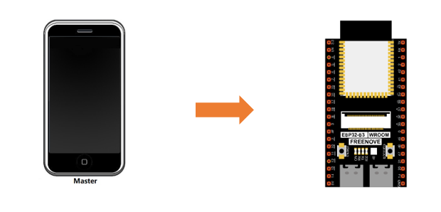

Circuit
==========================

Connect Freenove ESP32-S3 to the computer using the USB cable.

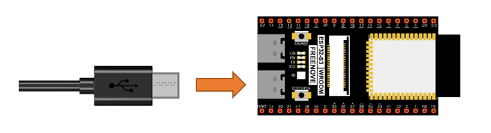

Sketch
=========================

Lightblue
---------------------------

If you can't install Serial Bluetooth on your phone, try LightBlue.If you do not have this software installed on your phone, you can refer to this link：https://apps.apple.com/us/app/lightblue/id557428110#?platform=iphone.

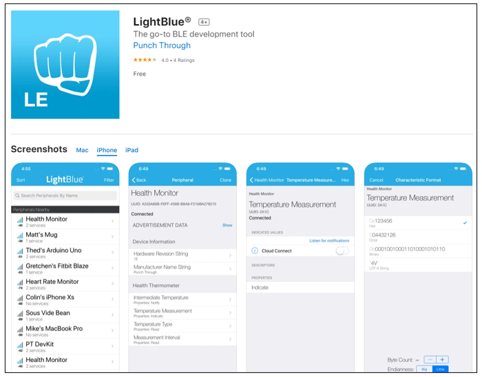

Step1. Upload the code of Project 27.1 to ESP32-S3.

Step2. Click on serial monitor.

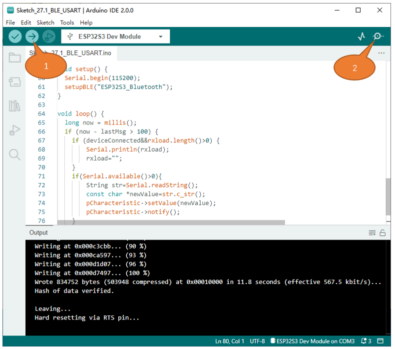

Step3. Set baud rate to 115200.

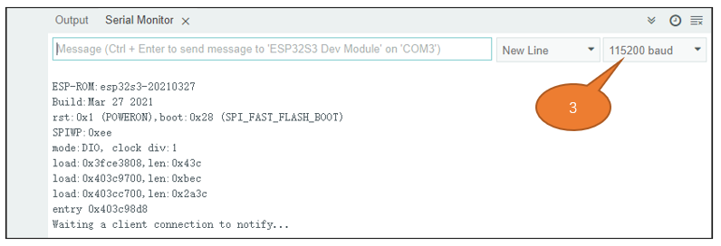

Turn ON Bluetooth on your phone, and open the Lightblue APP. 

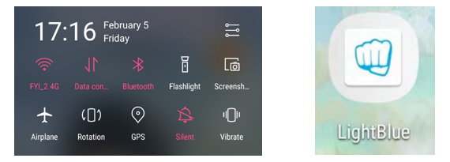

In the Scan page, swipe down to refresh the name of Bluetooth that the phone searches for. Click ESP32S3_Bluetooth.

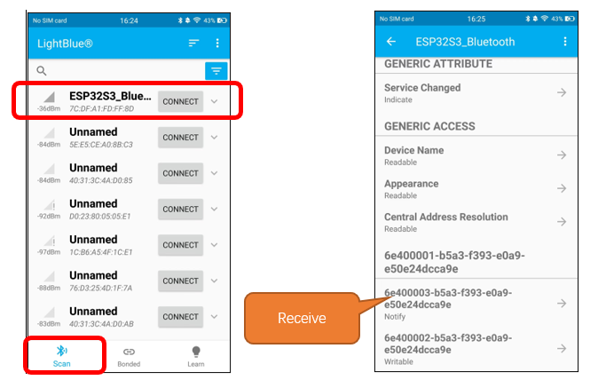

Click "Receive". Select the appropriate Data format in the box to the right of Data Format. For example, HEX for hexadecimal, utf-string for character, Binary for Binary, etc. Then click SUBSCRIBE.

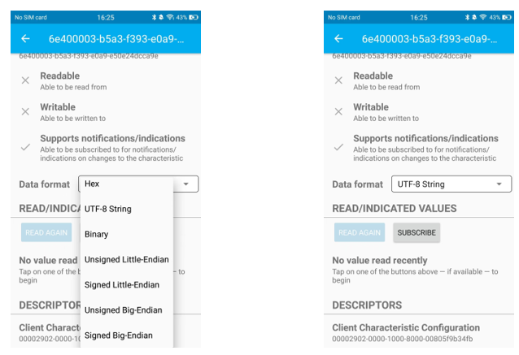

Back to the serial monitor on your computer. You can type anything in the left border of Send, and then click Send. 

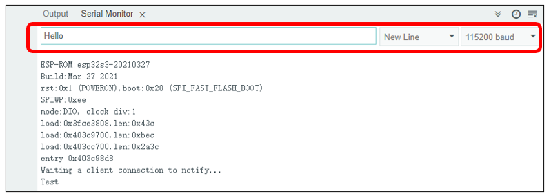

And then you can see the mobile Bluetooth has received the message.

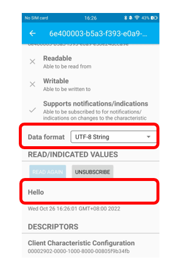

Similarly, you can select "Send" on your phone. Set Data format, and then enter anything in the sending box and click Write to send.

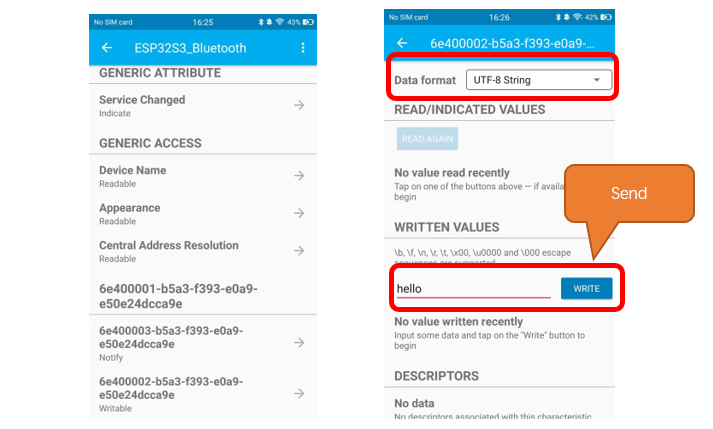

And the computer will receive the message from the mobile Bluetooth.

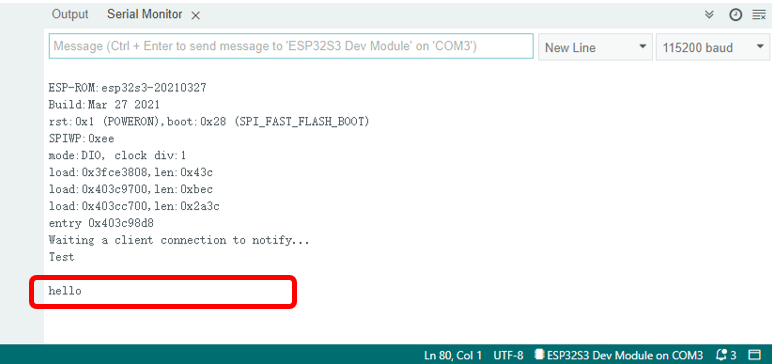

And now data can be transferred between your mobile phone and computer via ESP32-S3 WROOM.

The following is the program code:

.. literalinclude:: ../../../freenove_Kit/C/Sketches/Sketch_27.1_BLE_USART/Sketch_27.1_BLE_USART.ino
    :linenos: 
    :language: c
    :dedent:

Define the specified UUID number for BLE vendor.

.. literalinclude:: ../../../freenove_Kit/C/Sketches/Sketch_27.1_BLE_USART/Sketch_27.1_BLE_USART.ino
    :linenos: 
    :language: c
    :lines: 18-20
    :dedent:

Write a Callback function for BLE server to manage connection of BLE.

.. literalinclude:: ../../../freenove_Kit/C/Sketches/Sketch_27.1_BLE_USART/Sketch_27.1_BLE_USART.ino
    :linenos: 
    :language: c
    :lines: 22-30
    :dedent:

Write Callback function with BLE features. When it is called, as the mobile terminal send data to ESP32-S3, it will store them into reload.

.. literalinclude:: ../../../freenove_Kit/C/Sketches/Sketch_27.1_BLE_USART/Sketch_27.1_BLE_USART.ino
    :linenos: 
    :language: c
    :lines: 32-42
    :dedent:

Initialize the BLE function and name it.

.. literalinclude:: ../../../freenove_Kit/C/Sketches/Sketch_27.1_BLE_USART/Sketch_27.1_BLE_USART.ino
    :linenos: 
    :language: c
    :lines: 61-61
    :dedent:

When the mobile phone send data to ESP32-S3 via BLE Bluetooth, it will print them out with serial port; 

When the serial port of ESP32-S3 receive data, it will send them to mobile via BLE Bluetooth.

.. literalinclude:: ../../../freenove_Kit/C/Sketches/Sketch_27.1_BLE_USART/Sketch_27.1_BLE_USART.ino
    :linenos: 
    :language: c
    :lines: 65-78
    :dedent:

The design for creating the BLE server is:

1. Create a BLE Server

2. Create a BLE Service

3. Create a BLE Characteristic on the Service

4. Create a BLE Descriptor on the characteristic

5. Start the service.

6. Start advertising.

.. literalinclude:: ../../../freenove_Kit/C/Sketches/Sketch_27.1_BLE_USART/Sketch_27.1_BLE_USART.ino
    :linenos: 
    :language: c
    :lines: 44-57
    :dedent:

Project Bluetooth Control LED
*****************************************

In this section, we will control the LED with Bluetooth.

Component List
================================

+-----------------------------+----------------------------------+
| ESP32-S3 WROOM x1           | GPIO Extension Board x1          |
|                             |                                  |
| |Chapter01_00|              | |Chapter01_01|                   |
+-----------------------------+----------------------------------+
| Breadboard x1                                                  |
|                                                                |
| |Chapter01_02|                                                 |
+-----------------------------+----------------------------------+
| Resistor 220Ω x1            | Jumper M/M x2                    |
|                             |                                  |
| |Chapter01_04|              |  |Chapter19_02|                  |
+-----------------------------+----------------------------------+
| LED x1                      | Micro USB Wire x1                |
|                             |                                  |
| |Chapter01_04|              |  |Chapter08_00|                  |
+-----------------------------+----------------------------------+

.. |Chapter01_00| image:: ../_static/imgs/1_LED/Chapter01_00.png
.. |Chapter01_01| image:: ../_static/imgs/1_LED/Chapter01_01.png
.. |Chapter01_02| image:: ../_static/imgs/1_LED/Chapter01_02.png
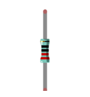

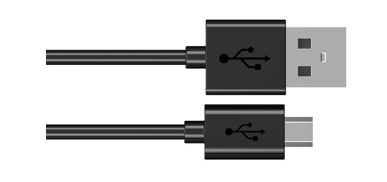

Circuit
=================================

Connect Freenove ESP32-S3 to the computer using a USB cable.

.. list-table::
   :width: 100%
   :align: center
   
   * -  Schematic diagram
   * -  |Chapter27_12|
   * -  Hardware connection. 
       
        :red:`If you need any support, please contact us via:` support@freenove.com
   * -  |Chapter27_13|

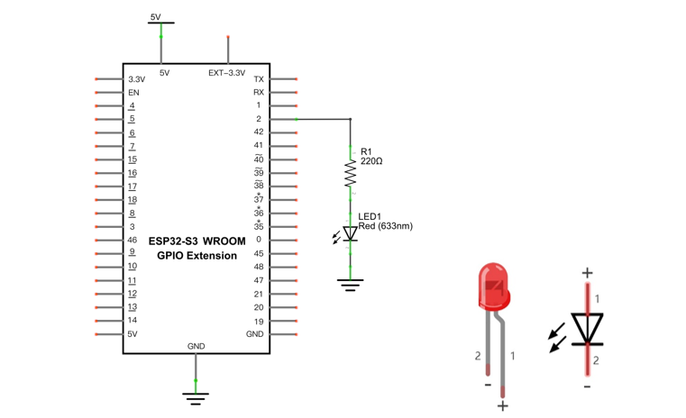
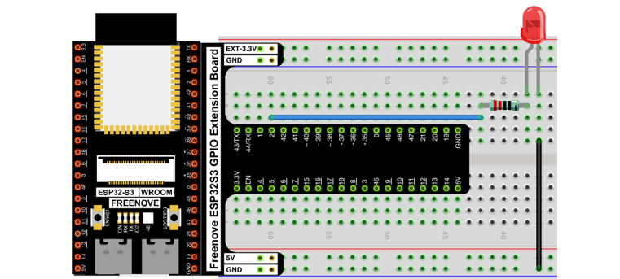

Sketch
=================================

Sketch_Bluetooth_Control_LED
-------------------------------------------

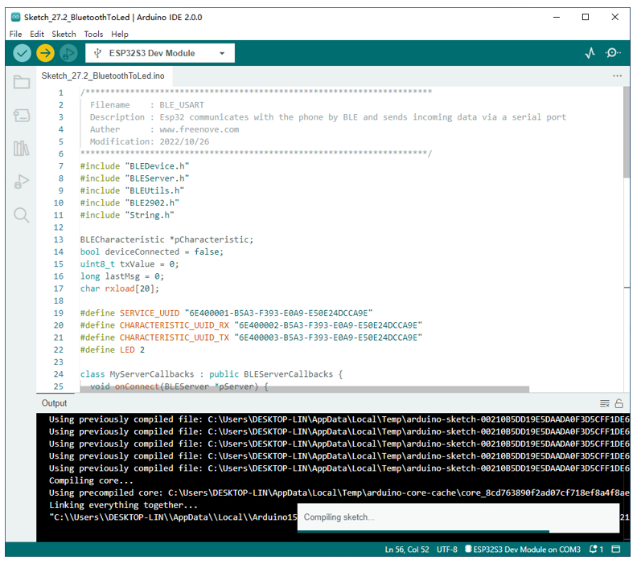

Compile and upload code to ESP32S3_Blueooth. The operation of the APP is the same as 27.1, you only need to change the sending content to "led_on" and "led_off" to operate LEDs on the ESP32-S3 WROOM. Data sent from mobile APP:

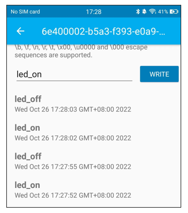

Display on the serial port of the computer:

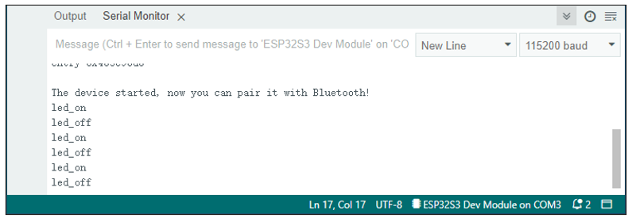

The phenomenon of LED

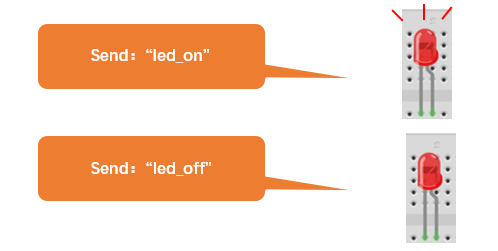

Attention: If the sending content isn't "led-on' or "led-off", then the state of LED will not change. If the LED is on, when receiving irrelevant content, it keeps on; Correspondingly, if the LED is off, when receiving irrelevant content, it keeps off.

The following is the program code:

.. literalinclude:: ../../../freenove_Kit/C/Sketches/Sketch_27.2_BluetoothToLed/Sketch_27.2_BluetoothToLed.ino
    :linenos: 
    :language: c
    :dedent:

Use character string to handle function header file.

.. literalinclude:: ../../../freenove_Kit/C/Sketches/Sketch_27.2_BluetoothToLed/Sketch_27.2_BluetoothToLed.ino
    :linenos: 
    :language: c
    :lines: 11-11
    :dedent:

Define a character array to save data from Bluetooth.

.. literalinclude:: ../../../freenove_Kit/C/Sketches/Sketch_27.2_BluetoothToLed/Sketch_27.2_BluetoothToLed.ino
    :linenos: 
    :language: c
    :lines: 17-17
    :dedent:

Initialize the BLE Bluetooth and name it as "ESP32-S3"

.. literalinclude:: ../../../freenove_Kit/C/Sketches/Sketch_27.2_BluetoothToLed/Sketch_27.2_BluetoothToLed.ino
    :linenos: 
    :language: c
    :lines: 65-65
    :dedent:

Write a Callback function for BLE server to manage connection of BLE.

.. literalinclude:: ../../../freenove_Kit/C/Sketches/Sketch_27.2_BluetoothToLed/Sketch_27.2_BluetoothToLed.ino
    :linenos: 
    :language: c
    :lines: 24-32
    :dedent:

Write Callback function with BLE features. When it is called, as the mobile terminal send data to ESP32-S3, it will store them into reload.

.. literalinclude:: ../../../freenove_Kit/C/Sketches/Sketch_27.2_BluetoothToLed/Sketch_27.2_BluetoothToLed.ino
    :linenos: 
    :language: c
    :lines: 36-44
    :dedent:

Compare the content in buffer array with "led_on" and "led_off" to see whether they are the same. If yes, execute the corresponding operation. 

.. literalinclude:: ../../../freenove_Kit/C/Sketches/Sketch_27.2_BluetoothToLed/Sketch_27.2_BluetoothToLed.ino
    :linenos: 
    :language: c
    :lines: 73-82
    :dedent:

After comparing the content of array, to ensure successful transmission next time, please empty the array.

.. literalinclude:: ../../../freenove_Kit/C/Sketches/Sketch_27.2_BluetoothToLed/Sketch_27.2_BluetoothToLed.ino
    :linenos: 
    :language: c
    :lines: 80-81
    :dedent:

Reference
-----------------------------

strncmp() functions are often used for string comparisons, which are accurate and stable.

.. py:function:: int strncmp(const char *str1, const char *str2, size_t n)	

    str1: the first string to be compared 

    str2: the second string to be compared 

    n: the biggest string to be compared

    Return value: if stir1>str2, then return value>0.

        If return value is 0, then the contents of str1 and str2 are the same.

        If str1< str2, then return value<0.
    
Function memset is mainly used to clean and initialize the memory of array

.. py:function:: void memset(void *s, int c, unsigned long n)	

    Function memset() is to set the content of a certain internal storage as specified value.

    *s: the initial address of the content to clear out. 

    c:to be replaced as specified value 

    n: the number of byte to be replaced
