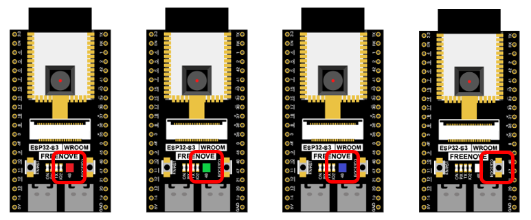

##############################################################################
Chapter Camera Web Server
##############################################################################

In this section, we'll use ESP32-S3's video function as an example to study.

Project Camera Web Server
*********************************************

Connect ESP32-S3 using USB and check its IP address through serial monitor. Use web page to access IP address to obtain video and image data.

Component List
=============================================

+-----------------------------+----------------------------------+
| ESP32-S3 WROOM x1           | USB cable x1                     |
|                             |                                  |
| |Chapter32_00|              | |Chapter00_01|                   |
+-----------------------------+----------------------------------+

.. |Chapter00_01| image:: ../_static/imgs/0_LED/Chapter00_01.png

Circuit
============================

Connect Freenove ESP32-S3 to the computer using the USB cable. 

Sketch
============================

Sketch_As_CameraWebServer
-------------------------------------

Before running the program, please modify your router's name and password in the box shown in the illustration above to make sure that your Sketch can compile and work successfully. 

Compile and upload codes to ESP32-S3, open the serial monitor and set the baud rate to 115200, and the serial monitor will print out a network link address.

If your ESP32-S3 has been in the process of connecting to router, but the information above has not been printed out, please re-check whether the router name and password have been entered correctly and press the reset key on ESP32-S3 WROOM to wait for a successful connection prompt. 

Open a web browser, enter the IP address printed by the serial monitor in the address bar, and access it. 

Taking the Google browser as an example, here's what the browser prints out after successful access to ESP32-S3's IP.

Click on Start Stream. The effect is shown in the image below.

.. note:: 
    
    If sketch compilation fails due to ESP32-S3 support package, follow the steps of the image to open the CameraWebServer. This sketch is the same as described in the tutorial above.  

The following is the main program code. You need include other code files in the same folder when write your own code.

.. literalinclude:: ../../../freenove_Kit/C/Sketches/Sketch_32.1_CameraWebServer/Sketch_32.1_CameraWebServer.ino
    :linenos: 
    :language: c
    :dedent:

Add procedure files and API interface files related to ESP32-S3 camera.

.. code-block:: C

    #include "esp_camera.h"
    #include <WiFi.h>

    #define CAMERA_MODEL_ESP32S3_EYE // Has PSRAM

    #include "camera_pins.h"

Enter the name and password of the router 

.. literalinclude:: ../../../freenove_Kit/C/Sketches/Sketch_32.1_CameraWebServer/Sketch_32.1_CameraWebServer.ino
    :linenos: 
    :language: c
    :lines: 33-34
    :dedent:

Initialize serial port, set baud rate to 115200; open the debug and output function of the serial.

.. literalinclude:: ../../../freenove_Kit/C/Sketches/Sketch_32.1_CameraWebServer/Sketch_32.1_CameraWebServer.ino
    :linenos: 
    :language: c
    :lines: 39-41
    :dedent:

Configure parameters including interface pins of the camera. Note: It is generally not recommended to change them.

.. literalinclude:: ../../../freenove_Kit/C/Sketches/Sketch_32.1_CameraWebServer/Sketch_32.1_CameraWebServer.ino
    :linenos: 
    :language: c
    :lines: 43-68
    :dedent:

ESP32-S3 connects to the router and prints a successful connection prompt. If it has not been successfully connected, press the reset key on the ESP32-S3 WROOM.

.. literalinclude:: ../../../freenove_Kit/C/Sketches/Sketch_32.1_CameraWebServer/Sketch_32.1_CameraWebServer.ino
    :linenos: 
    :language: c
    :lines: 95-107
    :dedent:

Open the video streams server function of the camera and print its IP address via serial port.

.. literalinclude:: ../../../freenove_Kit/C/Sketches/Sketch_32.1_CameraWebServer/Sketch_32.1_CameraWebServer.ino
    :linenos: 
    :language: c
    :lines: 109-113
    :dedent:

Configure the display image information of the camera.

The set_vflip() function sets whether the image is flipped 180°, with 0 for no flip and 1 for flip 180°.

The set_brightness() function sets the brightness of the image, with values ranging from -2 to 2.

The set_saturation() function sets the color saturation of the image, with values ranging from -2 to 2.

.. literalinclude:: ../../../freenove_Kit/C/Sketches/Sketch_32.1_CameraWebServer/Sketch_32.1_CameraWebServer.ino
    :linenos: 
    :language: c
    :lines: 89-93
    :dedent:

Modify the resolution and sharpness of the images captured by the camera. The sharpness ranges from 10 to 63, and the smaller the number, the sharper the picture. The larger the number, the blurrier the picture. Please refer to the table below.

.. code-block:: C

    config.frame_size = FRAMESIZE_VGA;
    config.jpeg_quality = 10;

Reference
----------------------------------

+-------------------+-----------+------------------+-----------+
| Image resolution  | Sharpness | Image resolution | Sharpness |
+===================+===========+==================+===========+
| FRAMESIZE_96x96   | 96x96     | FRAMESIZE_HVGA   | 480x320   |
+-------------------+-----------+------------------+-----------+
| FRAMESIZE_QQVGA   | 160x120   | FRAMESIZE_VGA    | 640x480   |
+-------------------+-----------+------------------+-----------+
| FRAMESIZE_QCIF    | 176x144   | FRAMESIZE_SVGA   | 800x600   |
+-------------------+-----------+------------------+-----------+
| FRAMESIZE_HQVGA   | 240x176   | FRAMESIZE_XGA    | 1024x768  |
+-------------------+-----------+------------------+-----------+
| FRAMESIZE_240x240 | 240x240   | FRAMESIZE_HD     | 1280x720  |
+-------------------+-----------+------------------+-----------+
| FRAMESIZE_QVGA    | 320x240   | FRAMESIZE_SXGA   | 1280x1024 |
+-------------------+-----------+------------------+-----------+
| FRAMESIZE_CIF     | 400x296   | FRAMESIZE_UXGA   | 1600x1200 |
+-------------------+-----------+------------------+-----------+

:red:`We recommend that the resolution not exceed VGA(640x480).`

Project Video Web Server
*****************************************

Connect to ESP32-S3 using USB and view its IP address through a serial monitor. Access IP addresses through web pages to obtain real-time video data.

Component List
===================================

.. list-table:: 
   :width: 100%
   :header-rows: 1 
   :align: center
   
   * -  ESP32-S3 WROOM x1
     -  USB cable x1
     -  SDcard x1

   * -  |Chapter00_00|
     -  |Chapter00_01|
     -  |Chapter28_01|

.. |Chapter00_00| image:: ../_static/imgs/0_LED/Chapter00_00.png
.. |Chapter00_01| image:: ../_static/imgs/0_LED/Chapter00_01.png
.. |Chapter28_01| image:: ../_static/imgs/28_Read_and_Write_the_SDcard/Chapter28_01.png

Circuit
=================================

Connect Freenove ESP32-S3 to the computer using the USB cable. 

Sketch
================================

Sketch_As_VideoWebServer
---------------------------------

Before running the program, please modify your router's name and password in the box shown in the illustration above to make sure that your Sketch can compile and work successfully. 

Compile and upload codes to ESP32-S3, open the serial monitor and set the baud rate to 115200, and the serial monitor will print out a network link address.

If your ESP32-S3 has been in the process of connecting to router, but the information above has not been printed out, please re-check whether the router name and password have been entered correctly and press the reset key on ESP32-S3 WROOM to wait for a successful connection prompt. 

Open a web browser, enter the IP address printed by the serial monitor in the address bar, and access it. 

Taking the Google browser as an example, here's what the browser prints out after successful access to ESP32-S3's IP.

The effect is shown in the image below.

The following is the main program code. You need include other code files in the same folder when write your own code.

.. literalinclude:: ../../../freenove_Kit/C/Sketches/Sketch_32.2_As_VideoWebServer/Sketch_32.2_As_VideoWebServer.ino
    :linenos: 
    :language: c
    :dedent:

Configure parameters including interface pins of the camera. Note: It is generally not recommended to change them.

.. literalinclude:: ../../../freenove_Kit/C/Sketches/Sketch_32.2_As_VideoWebServer/Sketch_32.2_As_VideoWebServer.ino
    :linenos: 
    :language: c
    :lines: 54-79
    :dedent:

ESP32-S3 connects to the router and prints a successful connection prompt. If it has not been successfully connected, press the reset key on the ESP32-S3 WROOM.

.. literalinclude:: ../../../freenove_Kit/C/Sketches/Sketch_32.2_As_VideoWebServer/Sketch_32.2_As_VideoWebServer.ino
    :linenos: 
    :language: c
    :lines: 32-39
    :dedent:

Open the video streams server function of the camera and print its IP address via serial port.

.. literalinclude:: ../../../freenove_Kit/C/Sketches/Sketch_32.2_As_VideoWebServer/Sketch_32.2_As_VideoWebServer.ino
    :linenos: 
    :language: c
    :lines: 41-45
    :dedent:

Project Camera and SDcard
***********************************

In this chapter, we continue to use the camera and SD card. We will use the onboard button as the shutter. When the button is pressed, the ESP32-S3 takes a photo and stores the photo in the SD folder.

Component List
============================

.. list-table:: 
   :width: 100%
   :header-rows: 1 
   :align: center
   
   * -  ESP32-S3 WROOM x1
     -  USB cable x1
     -  SDcard x1

   * -  |Chapter00_00|
     -  |Chapter00_01|
     -  |Chapter28_01|

.. |Chapter00_00| image:: ../_static/imgs/0_LED/Chapter00_00.png
.. |Chapter00_01| image:: ../_static/imgs/0_LED/Chapter00_01.png
.. |Chapter28_01| image:: ../_static/imgs/28_Read_and_Write_the_SDcard/Chapter28_01.png

Circuit
=================================

Connect Freenove ESP32-S3 to the computer using the USB cable. 

Sketch
================================

This code uses a library named "Freenove_WS2812_Lib_for_ESP32", if you have not installed it, please do so first.

Library is an important feature of the open source world, and we know that Arduino is an open source platform that everyone can contribute to. Libraries are generally licensed under the LGPL, which means you can use them for free to apply to your creations.

How to install the library
---------------------------------

There are two ways to add libraries.

The first way, open the Arduino IDE, click Sketch -> Include Library -> Manager Libraries.

In the pop-up window, Library Manager, search for the name of the Library, "Freenove WS2812 Lib for ESP32". Then click Install. 

The second way, open Arduino IDE, click Sketch->Include Library->Add .ZIP Library, In the pop-up window, find the file named "./Libraries/Freenove_WS2812_Lib_for_ESP32.Zip" which locates in this directory, and click OPEN.

Sketch_Camera_SDcard
--------------------------------

Compile and upload the code to the ESP32-S3.

If your camera is not installed properly, causing the camera to fail to initialize, or you have not inserted the SD card into the ESP32-S3 in advance, the on-board colored lights will turn on red as a reminder. If all is well, the onboard colored light will light up green. When the onboard BOOT button is pressed, the ESP32-S3 will capture the current camera image and save it in the "Camera" folder of the SD card. At the same time, the onboard LED lights up blue, and returns to green after taking a photo.

As shown in the image below, after uploading the code to the ESP32-S3, the ESP32-S3 will automatically create a folder named "camera" in the SD card. Every time the BOOT button is pressed, the on-board colored light turns on blue, and ESP32-S3 collects a photo information and stores it in the "camera" folder. Press the button once to take a photo.

When we press the RST button to reset the ESP32-S3, we can see that there are some photo files in the SD card folder. These photos you can read directly through the card reader.

The following is the main program code. You need include other code files in the same folder when write your own code.

.. literalinclude:: ../../../freenove_Kit/C/Sketches/Sketch_32.3_Camera_SDcard/Sketch_32.3_Camera_SDcard.ino
    :linenos: 
    :language: c
    :dedent:

Configure camera parameters, including camera interface pins and other information. Altering them is generally not recommended. Returns 1 if the camera is initialized successfully, and returns 0 if it fails.

.. literalinclude:: ../../../freenove_Kit/C/Sketches/Sketch_32.3_Camera_SDcard/Sketch_32.3_Camera_SDcard.ino
    :linenos: 
    :language: c
    :lines: 59-114
    :dedent:

Initialize the serial port, buttons, lights and SD card.

.. literalinclude:: ../../../freenove_Kit/C/Sketches/Sketch_32.3_Camera_SDcard/Sketch_32.3_Camera_SDcard.ino
    :linenos: 
    :language: c
    :lines: 16-21
    :dedent:

Call ws2812SetColor() to set the color of the LED. When the parameter is 0, the LED is turned off, when the parameter is 1, the red light is displayed, when the parameter is 2, the green light is displayed, and when the parameter is 3, the blue light is displayed.

.. literalinclude:: ../../../freenove_Kit/C/Sketches/Sketch_32.3_Camera_SDcard/Sketch_32.3_Camera_SDcard.ino
    :linenos: 
    :language: c
    :lines: 26-26
    :dedent:

Get the camera data once, then read the file number in the camera folder of the SD card, and create a new file based on this, write the camera data into it, and finally return the camera structure pointer. If the camera data cannot be obtained, the prompt information will be printed directly.

.. literalinclude:: ../../../freenove_Kit/C/Sketches/Sketch_32.3_Camera_SDcard/Sketch_32.3_Camera_SDcard.ino
    :linenos: 
    :language: c
    :lines: 40-53
    :dedent: