##############################################################################
Chapter USB
##############################################################################

In this chapter, we will learn some simple examples of USB ports.

Project USB Serial Example
*************************************

In this project, we have created a USB-to-serial bridge, allowing communication with the ESP32's hardware serial port via the USB interface.

Component List
========================

+-----------------------------+----------------------------------+
| ESP32-S3 WROOM x1           | USB cable x1                     |
|                             |                                  |
| |Chapter35_19|              | |Chapter00_01|                   |
+-----------------------------+----------------------------------+

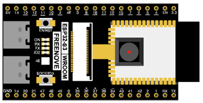
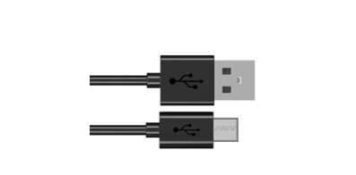

Power
========================

ESP32-S3 WROOM needs 5v power supply. In this tutorial, we need connect ESP32-S3 WROOM to computer via USB cable to power it and program it. We can also use other 5v power source to power it.

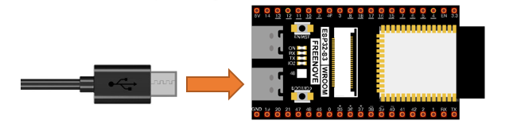

In the following projects, we only use USB cable to power ESP32-S3 WROOM by default.

In the whole tutorial, we don't use T extension to power ESP32-S3 WROOM. So 5V and 3.3V (includeing EXT 3.3V) on the extension board are provided by ESP32-S3 WROOM. 

We can also use DC jack of extension board to power ESP32-S3 WROOM. In this way, 5v and EXT 3.3v on extension board are provided by external power resource.

Component knowledge
======================

Difference between USB-OTG and USB-UART Interfaces
--------------------------------------------------------

As shown in the figure below, our development board includes two USB interfaces: USB-OTG and USB-UART.  

Among them, the USB-UART interface is connected to the on-board USB-to-TTL circuit, which is then connected to the ESP32-S3 module's serial port pins (TX: GPIO43 and RX: GPIO44).  

The USB-OTG interface is directly connected to the ESP32-S3 module's USB pins (USB_D-: GPIO19 and USB_D+: GPIO20).

+----------+-------------------------------------+----------------+
| USB-OTG  | The USB-OTG interface allows        | |Chapter35_00| |
|          |                                     |                |
|          | code uploads and can simulate       |                |
|          |                                     |                |
|          | peripherals such as a mouse,        |                |
|          |                                     |                |
|          | keyboard, computer controller, or   |                |
|          |                                     |                |
|          | gamepad based on the provided code. |                |
+----------+-------------------------------------+                +
| USB-UART | The USB-UART interface is           |                |
|          |                                     |                |
|          | primarily used for code upload and  |                |
|          |                                     |                |
|          | serial communication. It is more    |                |
|          |                                     |                |
|          | stable and reliable than USB-OTG.   |                |
+----------+-------------------------------------+----------------+

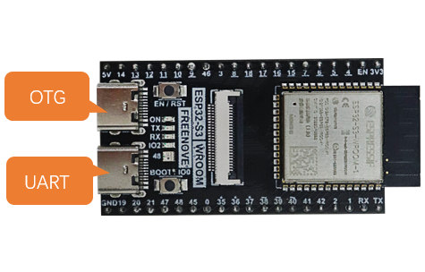

Enabling USB-OTG
----------------------------

Please note: To use the USB function of the ESP32-S3, you must enable the configuration boxed below. Otherwise, the code will not take effect.

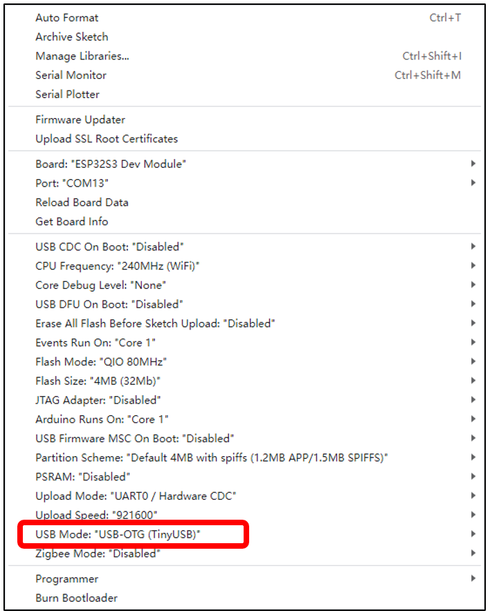

Sketch
======================

Sketch USBSerial
----------------------------

Click the icon to compile and upload the sketch to the ESP32S3.

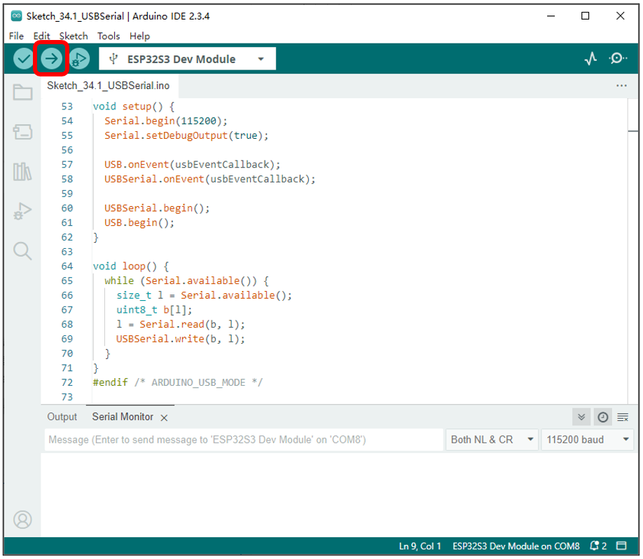

:combo:`red font-bolder:Note: You will need to prepare an additional USB cable to connect both USB interfaces simultaneously.`

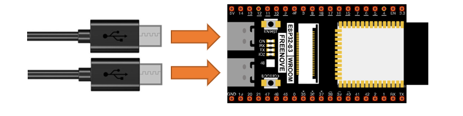

You can open a new interface by clicking File -> New Sketch.

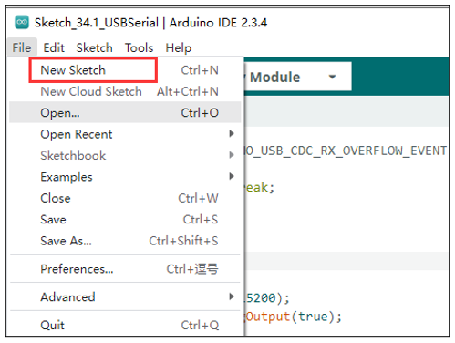

Select the COM port numbers corresponding to USB-UART and USB-OTG respectively in the two interfaces, open the serial monitors, and set the baud rate to 115200.

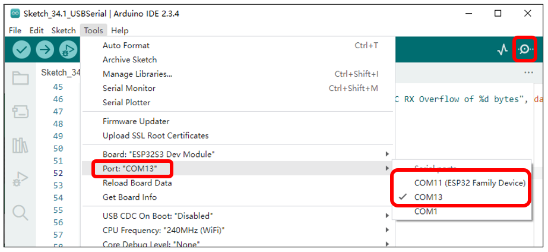

You can input any content in the serial monitor of the USB-UART port and press Enter. The ESP32-S3 will detect the data input from the USB-UART, package it, and send it to the USB-OTG. Similarly, when the ESP32-S3 detects data input from the USB-OTG, it will package the data and forward it to the USB-UART.

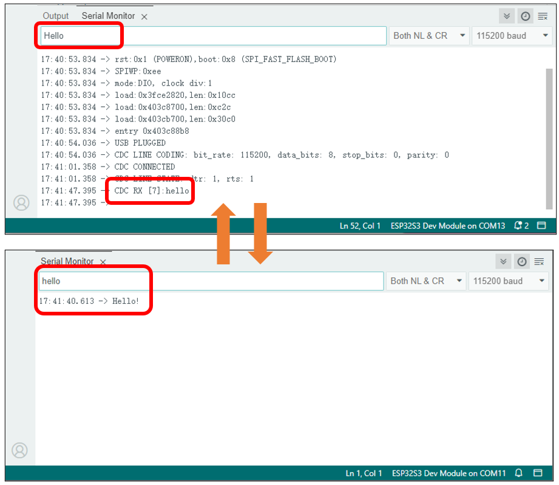

The communication between USB-OTG and USB-UART is similar to that described in the Serial Communication section.

The following is the program code:

.. literalinclude:: ../../../freenove_Kit/C/Sketches/Sketch_34.1_USBSerial/Sketch_34.1_USBSerial.ino
    :linenos: 
    :language: c
    :dedent:

Check the configuration information. If the configuration is incorrect, the code will not run properly. Please pay attention to the prompt messages during compilation.

.. literalinclude:: ../../../freenove_Kit/C/Sketches/Sketch_34.1_USBSerial/Sketch_34.1_USBSerial.ino
    :linenos: 
    :language: c
    :lines: 1-12
    :dedent:

The USB callback function is primarily used to handle USB events, CDC events, data reception events, and so on.

.. literalinclude:: ../../../freenove_Kit/C/Sketches/Sketch_34.1_USBSerial/Sketch_34.1_USBSerial.ino
    :linenos: 
    :language: c
    :lines: 14-51
    :dedent:

Initialize the serial port, configure callback functions for both USB and USBSerial, and then initialize USBSerial and USB. Note that USB.begin() should be placed last during initialization.

.. literalinclude:: ../../../freenove_Kit/C/Sketches/Sketch_34.1_USBSerial/Sketch_34.1_USBSerial.ino
    :linenos: 
    :language: c
    :lines: 53-62
    :dedent:

If data is received on the USB-UART interface, obtain the length of the data in the buffer, create an array, read the data from the buffer into the array, and then send the data out via the USB-OTG interface.

.. literalinclude:: ../../../freenove_Kit/C/Sketches/Sketch_34.1_USBSerial/Sketch_34.1_USBSerial.ino
    :linenos: 
    :language: c
    :lines: 64-71
    :dedent:

If you wish to learn more about USBSerial, you can select it in the code, right-click, and choose "Go to Definition".

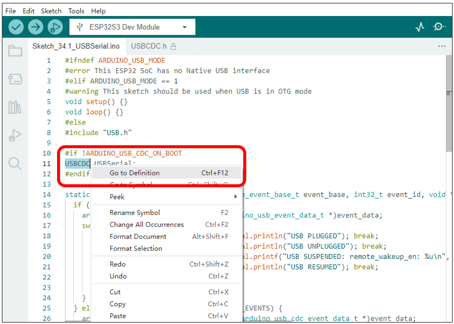

Project USB Mouse Example
**************************************

In this project, we will use the USB-OTG of the ESP32-S3 to emulate a computer's mouse functionality, allowing the ESP32-S3 to control the position and actions of the mouse. 

Component List
==========================

+-----------------------------+--------------------------+
| ESP32-S3 WROOM x1           | GPIO Extension Board x1  |
|                             |                          |
| |Chapter35_19|              | |Chapter01_01|           |
+-----------------------------+--------------------------+
| Breadboard x1                                          |
|                                                        |
| |Chapter01_02|                                         |
+-------------------+------------------+-----------------+
| Push button x4    | Resistor 10kΩ x4 | Jumper M/M x5   |
|                   |                  |                 |
| |Chapter02_02|    | |Chapter02_01|   | |Chapter01_05|  |
+-------------------+------------------+-----------------+

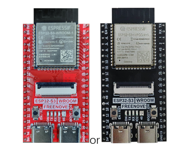
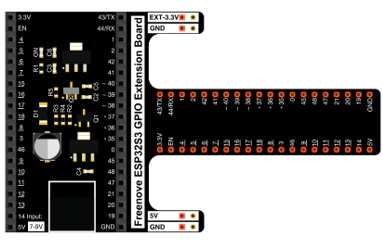
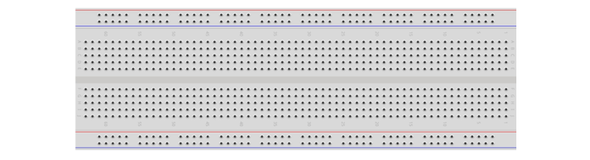
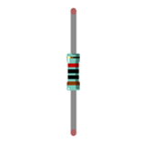
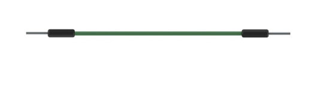
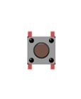

Power
----------------------------

ESP32-S3 WROOM needs 5V power supply.

In this tutorial, we connect ESP32-S3 WROOM's USB-UART to computer via USB cable to power and program it. 

After uploading the code, you can also use other 5V power source to power it.

In the following projects, we only use USB cable to power ESP32-S3 WROOM by default.

In the whole tutorial, we don't use DC jack on the T extension board to power ESP32-S3 WROOM, so 5V and 3.3V (including EXT 3.3V) on the extension board are provided by ESP32-S3 WROOM. 

If power supply is connected to the DC jack of extension board to power ESP32-S3 WROOM, the extension board’s 5V and EXT 3.3V are provided by external power resource.

Circuit
=============================

+--------------------------------------------------------------------------------------------------------+
| Schematic diagram                                                                                      |
|                                                                                                        |
| |Chapter35_08|                                                                                         |
+--------------------------------------------------------------------------------------------------------+
| Hardware connection. If you need any support, please feel free to contact us via: support@freenove.com |
|                                                                                                        |
| |Chapter35_09|                                                                                         |
+--------------------------------------------------------------------------------------------------------+

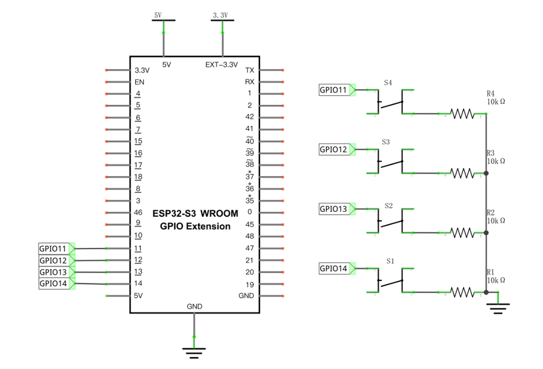
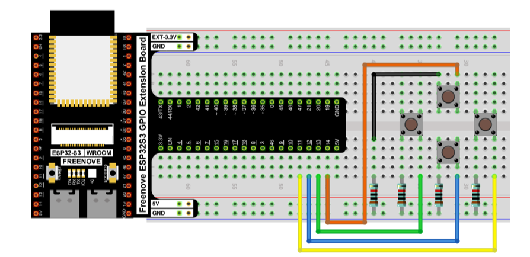

Sketch
=====================

Sketch_MouseControl
-------------------------------

Compile and upload the code to ESP32S3.

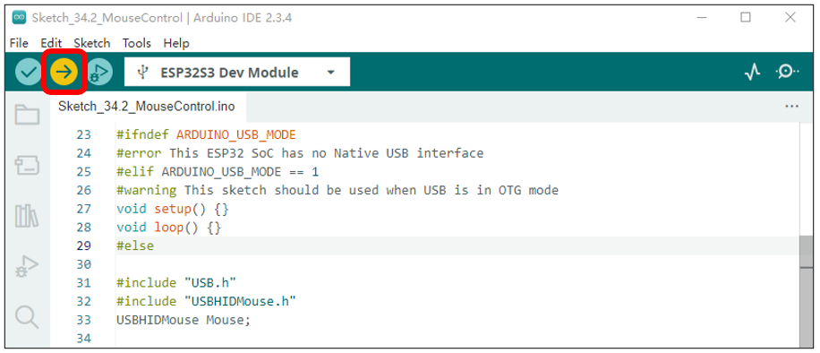

:combo:`red font-bolder:Important note: Upon the code finishes uploading, connect the USB cable to the USB-OTG interface.`

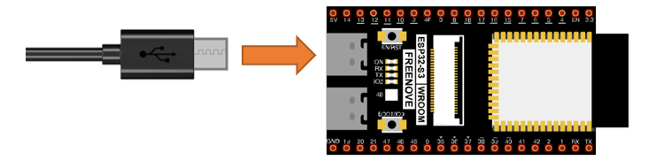

When the button is pressed, the ESP32-S3 emulates the movement of a mouse on the computer screen. 

When the onboard IO0 button is pressed, the ESP32-S3 emulates a left mouse click.

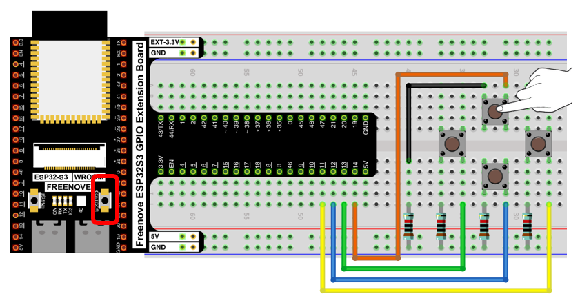

The following is the program code:

.. literalinclude:: ../../../freenove_Kit/C/Sketches/Sketch_34.2_MouseControl/Sketch_34.2_MouseControl.ino
    :linenos: 
    :language: c
    :dedent:

Verify the configuration settings. If the configuration is incorrect, the program will not execute as expected. Please review the compilation prompts for details.

.. literalinclude:: ../../../freenove_Kit/C/Sketches/Sketch_34.2_MouseControl/Sketch_34.2_MouseControl.ino
    :linenos: 
    :language: c
    :lines: 23-29
    :dedent:

Header files related to USB HID mouse functionality and the instantiation of a mouse class object. The methods in the USBHIDMouse class operate using a relative coordinate system by default.

.. literalinclude:: ../../../freenove_Kit/C/Sketches/Sketch_34.2_MouseControl/Sketch_34.2_MouseControl.ino
    :linenos: 
    :language: c
    :lines: 31-33
    :dedent:

USB mouse and USB driver initialization. Note that USB.begin() should be placed last during the initialization sequence.

.. literalinclude:: ../../../freenove_Kit/C/Sketches/Sketch_34.2_MouseControl/Sketch_34.2_MouseControl.ino
    :linenos: 
    :language: c
    :lines: 53-54
    :dedent:

Read the state of the button and, based on its status, have the ESP32-S3's USB-OTG emulate mouse movement signals.

.. literalinclude:: ../../../freenove_Kit/C/Sketches/Sketch_34.2_MouseControl/Sketch_34.2_MouseControl.ino
    :linenos: 
    :language: c
    :lines: 58-72
    :dedent:

Have GPIO0 emulate the left mouse click signal and the release signal.

.. literalinclude:: ../../../freenove_Kit/C/Sketches/Sketch_34.2_MouseControl/Sketch_34.2_MouseControl.ino
    :linenos: 
    :language: c
    :lines: 74-87
    :dedent:

If you wish to learn more about USBHIDMouse, you can select it in the code, right-click, and choose "Go to Definition".

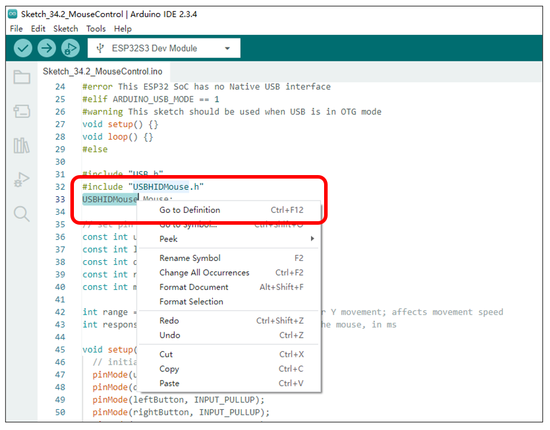

Project USB Keypad Example
***************************************

In this project, we plan to use the USB-OTG of the ESP32-S3 to emulate the keyboard functionality of a computer, allowing the ESP32-S3 to simulate keyboard input.

Component List
==========================

+-----------------------------+--------------------------+
| ESP32-S3 WROOM x1           | GPIO Extension Board x1  |
|                             |                          |
| |Chapter35_19|              | |Chapter01_01|           |
+-----------------------------+--------------------------+
| Breadboard x1                                          |
|                                                        |
| |Chapter01_02|                                         |
+-------------------+------------------+-----------------+
| Push button x4    | Resistor 10kΩ x4 | Jumper M/M x5   |
|                   |                  |                 |
| |Chapter02_02|    | |Chapter02_01|   | |Chapter01_05|  |
+-------------------+------------------+-----------------+

Power
----------------------

ESP32-S3 WROOM needs 5V power supply.

In this tutorial, we connect ESP32-S3 WROOM's USB-UART to computer via USB cable to power and program it. 

After uploading the code, you can also use other 5V power source to power it.

In the following projects, we only use USB cable to power ESP32-S3 WROOM by default.

In the whole tutorial, we don't use DC jack on the T extension board to power ESP32-S3 WROOM, so 5V and 3.3V (including EXT 3.3V) on the extension board are provided by ESP32-S3 WROOM. 

If power supply is connected to the DC jack of extension board to power ESP32-S3 WROOM, the extension board’s 5V and EXT 3.3V are provided by external power resource.

Circuit
=============================

+--------------------------------------------------------------------------------------------------------+
| Schematic diagram                                                                                      |
|                                                                                                        |
| |Chapter35_08|                                                                                         |
+--------------------------------------------------------------------------------------------------------+
| Hardware connection. If you need any support, please feel free to contact us via: support@freenove.com |
|                                                                                                        |
| |Chapter35_09|                                                                                         |
+--------------------------------------------------------------------------------------------------------+

Sketch
===============================

Sketch_KeyboardControl
----------------------------------

Compile and upload the code to the ESP32S3.

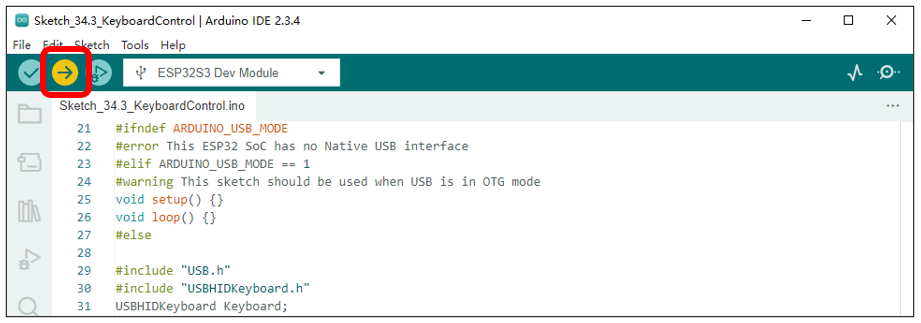

:combo:`red font-bolder:Important note: Upon the code finishes uploading, connect the USB cable to the USB-OTG interface.`

When the four buttons on the breadboard are pressed, the ESP32-S3 emulates the pressing of the directional arrow keys on a computer keyboard. 

When the onboard IO0 button is pressed, the ESP32-S3 emulates the pressing of the space bar on a computer keyboard.

The following is the program code:

.. literalinclude:: ../../../freenove_Kit/C/Sketches/Sketch_34.3_KeyboardControl/Sketch_34.3_KeyboardControl.ino
    :linenos: 
    :language: c
    :dedent:

Verify the configuration settings. If the configuration is incorrect, the program will not execute as expected. Please review the compilation prompts for details.

.. literalinclude:: ../../../freenove_Kit/C/Sketches/Sketch_34.3_KeyboardControl/Sketch_34.3_KeyboardControl.ino
    :linenos: 
    :language: c
    :lines: 21-28
    :dedent:

Header files related to USB HID keyboard and the instantiation of a keyboard class object.

.. literalinclude:: ../../../freenove_Kit/C/Sketches/Sketch_34.3_KeyboardControl/Sketch_34.3_KeyboardControl.ino
    :linenos: 
    :language: c
    :lines: 30-32
    :dedent:

USB keyboard and USB driver initialization. Note that USB.begin() should be called last in the initialization sequence.

.. literalinclude:: ../../../freenove_Kit/C/Sketches/Sketch_34.3_KeyboardControl/Sketch_34.3_KeyboardControl.ino
    :linenos: 
    :language: c
    :lines: 48-49
    :dedent:

Read the state of the buttons and, based on their status, have the ESP32-S3's USB-OTG emulate the signals for pressing the directional keys and the space bar.

.. literalinclude:: ../../../freenove_Kit/C/Sketches/Sketch_34.3_KeyboardControl/Sketch_34.3_KeyboardControl.ino
    :linenos: 
    :language: c
    :lines: 52-70
    :dedent:

If you wish to learn more about USBHIDKeyboard, you can select it in the code, right-click, and choose "Go to Definition".

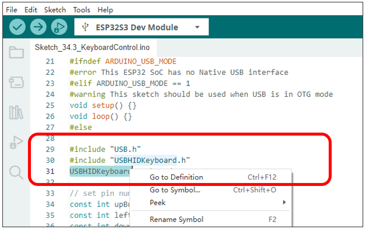

Project USB Control Device Example
***************************************

In this project, we will use the USB-OTG feature of the ESP32-S3 to demonstrate how to control computer media volume, screen brightness, and other similar functions.

Component List
==========================

+-----------------------------+--------------------------+
| ESP32-S3 WROOM x1           | GPIO Extension Board x1  |
|                             |                          |
| |Chapter35_19|              | |Chapter01_01|           |
+-----------------------------+--------------------------+
| Breadboard x1                                          |
|                                                        |
| |Chapter01_02|                                         |
+-------------------+------------------+-----------------+
| Push button x4    | Resistor 10kΩ x4 | Jumper M/M x5   |
|                   |                  |                 |
| |Chapter02_02|    | |Chapter02_01|   | |Chapter01_05|  |
+-------------------+------------------+-----------------+

Power
----------------------

ESP32-S3 WROOM needs 5V power supply.

In this tutorial, we connect ESP32-S3 WROOM's USB-UART to computer via USB cable to power and program it. 

After uploading the code, you can also use other 5V power source to power it.

In the following projects, we only use USB cable to power ESP32-S3 WROOM by default.

In the whole tutorial, we don't use DC jack on the T extension board to power ESP32-S3 WROOM, so 5V and 3.3V (including EXT 3.3V) on the extension board are provided by ESP32-S3 WROOM. 

If power supply is connected to the DC jack of extension board to power ESP32-S3 WROOM, the extension board’s 5V and EXT 3.3V are provided by external power resource.

Circuit
=============================

+--------------------------------------------------------------------------------------------------------+
| Schematic diagram                                                                                      |
|                                                                                                        |
| |Chapter35_08|                                                                                         |
+--------------------------------------------------------------------------------------------------------+
| Hardware connection. If you need any support, please feel free to contact us via: support@freenove.com |
|                                                                                                        |
| |Chapter35_09|                                                                                         |
+--------------------------------------------------------------------------------------------------------+

Sketch
===============================

Sketch_ConsumerControl
----------------------------------

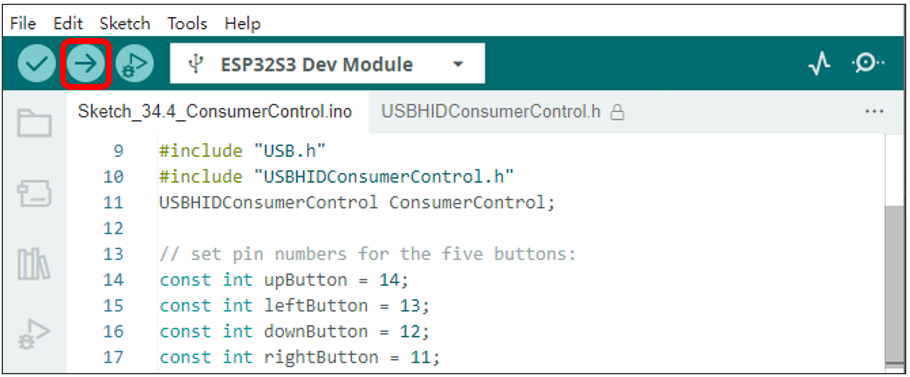

:combo:`red font-bolder:Important note: Upon the code finishes uploading, connect the USB cable to the USB-OTG interface.`

When the up and down buttons on the breadboard are pressed, the ESP32-S3 controls the computer's media volume to increase and decrease. 

When the left and right buttons on the breadboard are pressed, the ESP32-S3 controls the computer's screen brightness to increase and decrease.

The following is the program code:

.. literalinclude:: ../../../freenove_Kit/C/Sketches/Sketch_34.4_ConsumerControl/Sketch_34.4_ConsumerControl.ino
    :linenos: 
    :language: c
    :dedent:

Verify the configuration settings. If the configuration is incorrect, the program will not execute as expected. Please review the compilation prompts for details.

.. literalinclude:: ../../../freenove_Kit/C/Sketches/Sketch_34.4_ConsumerControl/Sketch_34.4_ConsumerControl.ino
    :linenos: 
    :language: c
    :lines: 1-8
    :dedent:

Header files related to USB device control and the instantiation of a device control class object.

.. literalinclude:: ../../../freenove_Kit/C/Sketches/Sketch_34.4_ConsumerControl/Sketch_34.4_ConsumerControl.ino
    :linenos: 
    :language: c
    :lines: 11-12
    :dedent:

USB device control class driver initialization, USB driver initialization. Note that USB.begin() should be called last in the initialization sequence.

.. literalinclude:: ../../../freenove_Kit/C/Sketches/Sketch_34.4_ConsumerControl/Sketch_34.4_ConsumerControl.ino
    :linenos: 
    :language: c
    :lines: 26-27
    :dedent:

Read the state of the buttons. If the up or down buttons are pressed, control the volume of the computer's media. If the left or right buttons are pressed, control the change in screen brightness.

.. literalinclude:: ../../../freenove_Kit/C/Sketches/Sketch_34.4_ConsumerControl/Sketch_34.4_ConsumerControl.ino
    :linenos: 
    :language: c
    :lines: 30-49
    :dedent:

If you wish to learn more about USBHIDKeyboard, you can select it in the code, right-click, and choose "Go to Definition".

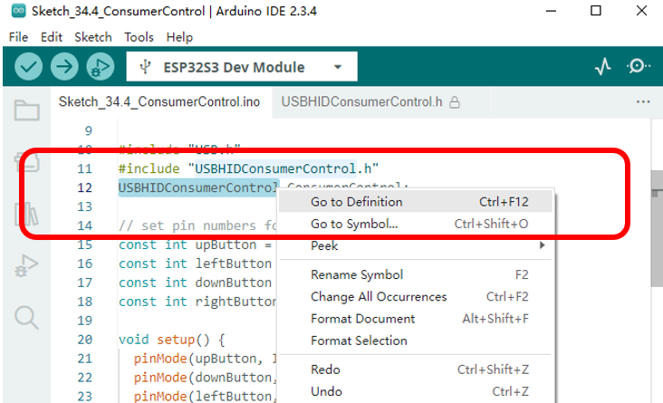