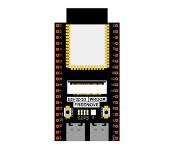
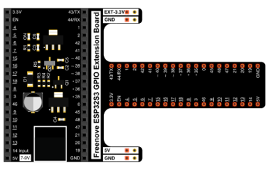
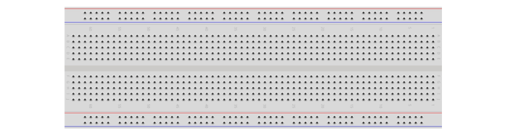
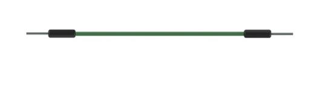
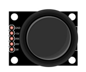
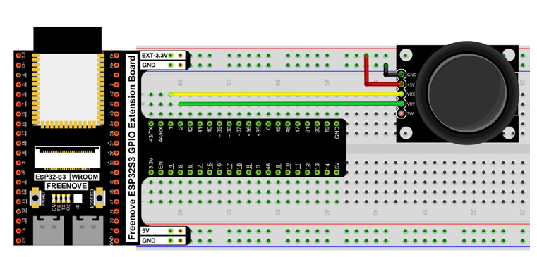
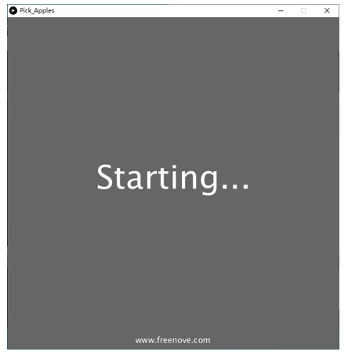
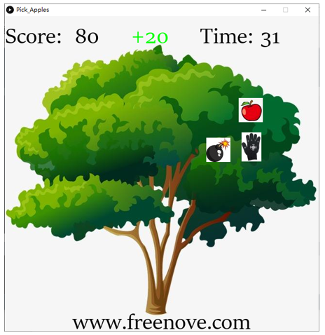
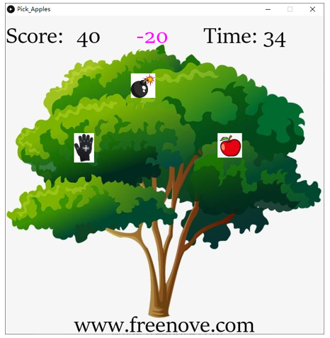
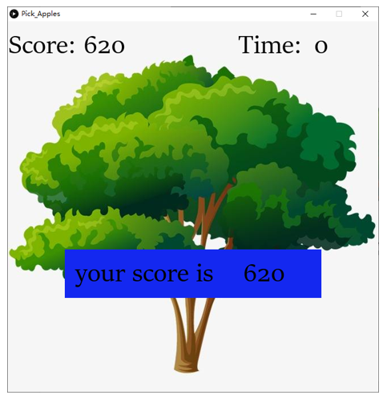

##############################################################################
Chapter Pick Apples
##############################################################################

In this chapter, we prepare pick apples game. You can use the joystick to pick apples. 

Project Pick Apples
************************************

Now, let's use Processing and ESP32S3 board to achieve the game.

Component list
=================================

+-----------------------------+----------------------------------+
| ESP32-S3 WROOM x1           | GPIO Extension Board x1          |
|                             |                                  |
| |Chapter01_00|              | |Chapter01_01|                   |
+-----------------------------+----------------------------------+
| Breadboard x1                                                  |
|                                                                |
| |Chapter01_02|                                                 |
+-----------------------------+----------------------------------+
| Jumper M/M x1               | Joystick x1                      |
|                             |                                  |
|  |Chapter01_05|             |  |Chapter14_00|                  |
+-----------------------------+----------------------------------+

Circuit
================================

Use GPIO1 and GPIO2 (A0 and A1) ports to detect the voltage value of two rotary potentiometers inside joystick.

.. list-table::
   :width: 100%
   :header-rows: 1 
   :align: center
   
   * -  Schematic diagram
   * -  |Chapter04_00|
   * -  Hardware connection. 
   * -  |Chapter04_01|

Sketch
===========================

Sketch Pick Apples
----------------------------

Use Processing to open Pick_Apples.pde and click Run. If the connection succeeds, the follow will be shown:

You can use the joystick to control the game. When the palm picked the apple, score +20. 

If the palm touches the bomb, the score is -20.

At the same time, you need to pick as many apples as possible before the countdown is over. 

When the game fails, press space bar to restart the game:

