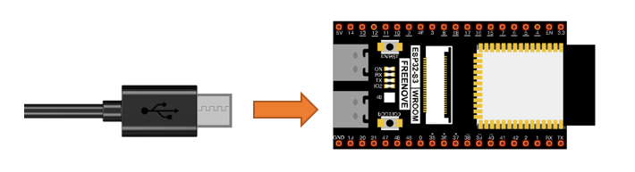
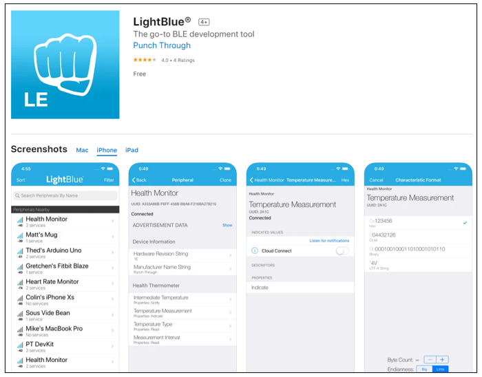
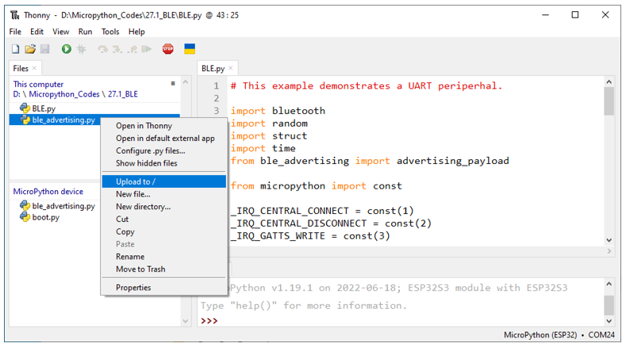
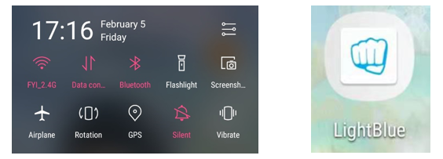
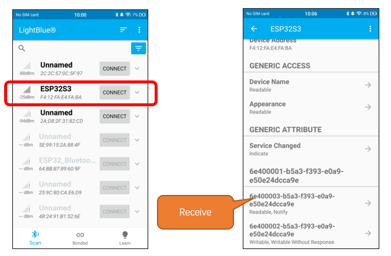
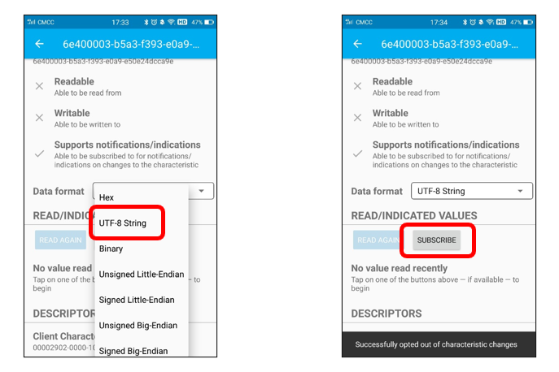
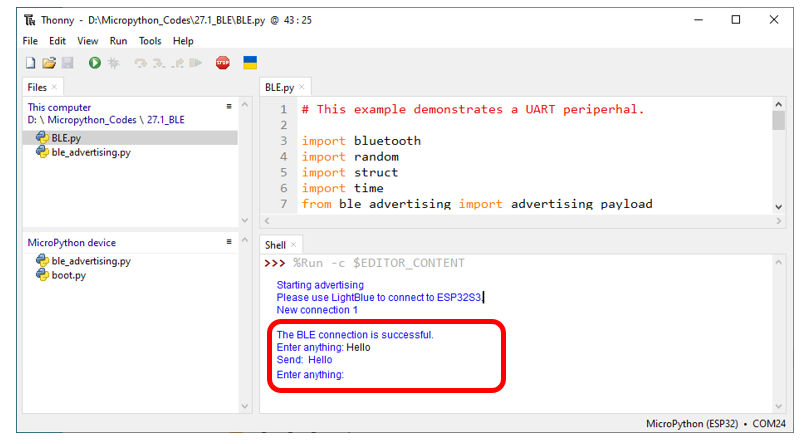

##############################################################################
Chapter Bluetooth
##############################################################################

This chapter mainly introduces how to make simple data transmission through Bluetooth of ESP32-S3 WROOM and mobile phones.

Project Bluetooth Low Energy Data Passthrough
*************************************************************

Component List
=============================

+-----------------------------+----------------------------------+
| ESP32-S3 WROOM x1           | USB cable x1                     |
|                             |                                  |
| |Chapter00_00|              | |Chapter00_01|                   |
+-----------------------------+----------------------------------+

.. |Chapter00_00| image:: ../_static/imgs/0_LED/Chapter00_00.png
.. |Chapter00_01| image:: ../_static/imgs/0_LED/Chapter00_01.png

Component knowledge
==============================

ESP32-S3's integrated Bluetooth function Bluetooth is a short-distance communication system, which can be divided into two types, namely Bluetooth Low Energy(BLE) and Classic Bluetooth. There are two modes for simple data transmission: master mode and slave mode.

Master mode
-------------------------------

In this mode, works are done in the master device and it can connect with a slave device. And we can search and select slave devices nearby to connect with. When a device initiates connection request in master mode, it requires information of the other Bluetooth devices including their address and pairing passkey. After finishing pairing, it can connect with them directly.

Slave mode
---------------------------------

The Bluetooth module in slave mode can only accept connection request from a host computer, but cannot initiate a connection request. After connecting with a host device, it can send data to or receive from the host device.

Bluetooth devices can make data interaction with each other, as one is in master mode and the other in slave mode. When they are making data interaction, the Bluetooth device in master mode searches and selects devices nearby to connect to. When establishing connection, they can exchange data. When mobile phones exchange data with ESP32-S3, they are usually in master mode and ESP32-S3 in slave mode.

.. image:: ../_static/imgs/27_Bluetooth/Chapter27_00.png
    :align: center

Circuit
==========================

Connect Freenove ESP32-S3 to the computer using the USB cable.

Code
=========================

Lightblue
---------------------------

If you can't install Serial Bluetooth on your phone, try LightBlue.If you do not have this software installed on your phone, you can refer to this link：https://apps.apple.com/us/app/lightblue/id557428110#?platform=iphone.

Move the program folder “/Python/Python_Codes” to disk(D) in advance with the path of “D:/Micropython_Codes”.

Open “Thonny”, click “This computer” -> “D:” -> “Micropython_Codes” -> “BLE”. Select “ble_advertising.py”, right click your mouse to select “Upload to /”, wait for “ble_advertising.py” to be uploaded to ESP32-S3 and then double click “BLE.py”. 

BLE
---------------------------

Click run for BLE.py.

.. image:: ../_static/imgs/27_Bluetooth/Chapter27_19.png
    :align: center

Turn ON Bluetooth on your phone, and open the Lightblue APP. 

In the Scan page, swipe down to refresh the name of Bluetooth that the phone searches for. Click ESP32S3.

After Bluetooth is connect successfully, Shell will printer the information.

.. image:: ../_static/imgs/27_Bluetooth/Chapter27_22.png
    :align: center

Click “Receive”. Select the appropriate Data format in the box to the right of Data Format. For example, HEX for hexadecimal, utf-string for character, Binary for Binary, etc. Then click SUBSCRIBE.

You can type “Hello” in Shell and press “Enter” to send.

And then you can see the mobile Bluetooth has received the message.

.. image:: ../_static/imgs/27_Bluetooth/Chapter27_25.png
    :align: center

Similarly, you can select “Send” on your phone. Set Data format, and then enter anything in the sending box and click Write to send.

.. image:: ../_static/imgs/27_Bluetooth/Chapter27_26.png
    :align: center

You can check the message from Bluetooth in “Shell”.

.. image:: ../_static/imgs/27_Bluetooth/Chapter27_27.png
    :align: center

And now data can be transferred between your mobile phone and computer via ESP32S3.

The following is the program code:

.. literalinclude:: ../../../freenove_Kit/Python/Python_Codes/02.1_BLE/BLE.py
    :linenos: 
    :language: python
    :dedent:

Define the specified UUID number for BLE vendor.

.. literalinclude:: ../../../freenove_Kit/Python/Python_Codes/02.1_BLE/BLE.py
    :linenos: 
    :language: python
    :lines: 20-28
    :dedent:

Write an _irq function to manage BLE interrupt events.

.. literalinclude:: ../../../freenove_Kit/Python/Python_Codes/02.1_BLE/BLE.py
    :linenos: 
    :language: python
    :lines: 46-63
    :dedent:

Initialize the BLE function and name it.

.. literalinclude:: ../../../freenove_Kit/Python/Python_Codes/02.1_BLE/BLE.py
    :linenos: 
    :language: python
    :lines: 36-36
    :dedent:

When the mobile phone send data to ESP32-S3 via BLE Bluetooth, it will print them out with serial port; When the serial port of ESP32-S3 receive data, it will send them to mobile via BLE Bluetooth.

.. literalinclude:: ../../../freenove_Kit/Python/Python_Codes/02.1_BLE/BLE.py
    :linenos: 
    :language: python
    :lines: 80-96
    :dedent:

.. include:: 27_2_Bluetooth.rst