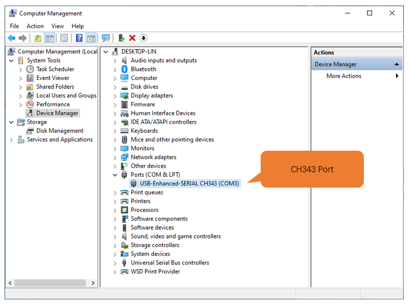
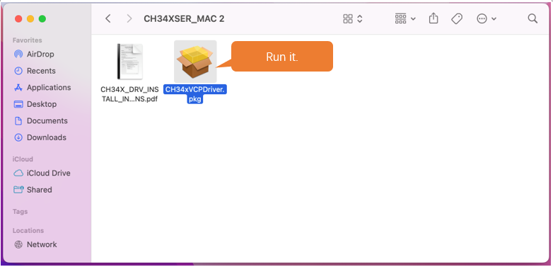
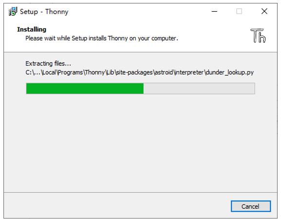
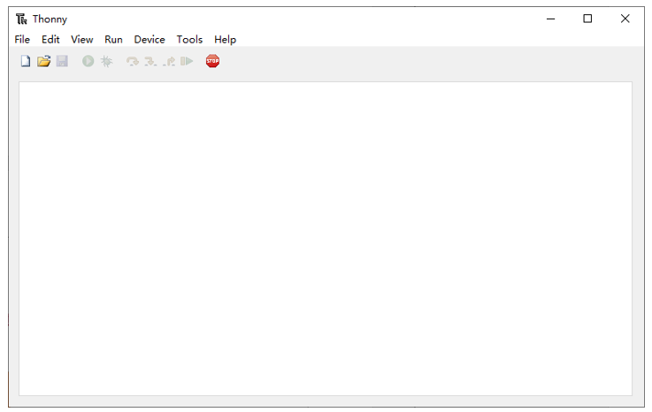
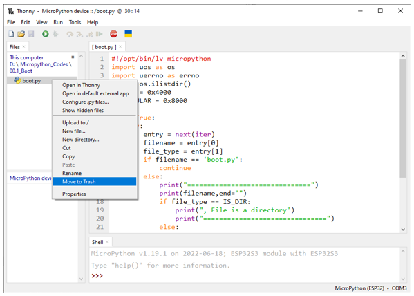

##############################################################################
Preface
##############################################################################

ESP32-S3 is a micro control unit with integrated Wi-Fi launched by Espressif, which features strong properties and integrates rich peripherals. It can be designed and studied as an ordinary Single Chip Micyoco(SCM) chip, or connected to the Internet and used as an Internet of Things device.

ESP32-S3 can be developed using the Arduino platform, which will definitely make it easier for people who have learned arduino to master. Moreover, the code of ESP32-S3 is completely open-source, so beginners can quickly learn how to develop and design IOT smart household products including smart curtains, fans, lamps and clocks.

Generally, ESP32-S3 projects consist of code and circuits. Don't worry even if you've never learned code and circuits, because we will gradually introduce the basic knowledge of C programming language and electronic circuits, from easy to difficult. Our products contain all the electronic components and modules needed to complete these projects. It's especially suitable for beginners.

We divide each project into four parts, namely Component List, Component Knowledge, Circuit and Code. Component List helps you to prepare material for the experiment more quickly. Component Knowledge allows you to quickly understand new electronic modules or components, while Circuit helps you understand the operating principle of the circuit. And Code allows you to easily master the use of SEP32 and accessory kit. After finishing all the projects in this tutorial, you can also use these components and modules to make products such as smart household, smart cars and robots to transform your creative ideas into prototypes and new and innovative products.

In addition, if you have any difficulties or questions with this tutorial or toolkit, feel free to ask for our quick and free technical support through support@freenove.com 

ESP32-S3 WROOM
************************

ESP32-S3-WROOM-1 has launched a total of two antenna packages, PCB on-board antenna and IPEX antenna respectively. The PCB on-board antenna is an integrated antenna in the chip module itself, so it is convenient to carry and design. The IPEX antenna is a metal antenna derived from the integrated antenna of the chip module itself, which is used to enhance the signal of the module.

.. list-table::
   :width: 100%
   :header-rows: 1
   :align: center
   
   * -  PCB on-board antenna
     -  IPEX antenna
 	
   * -  |Preface51|
     -  |Preface52|
 

In this tutorial, the ESP32-S3 WROOM is designed based on the PCB on-board antenna-packaged ESP32-S3-WROOM-1 module. 

ESP32-S3 WROOM

The hardware interfaces of ESP32-S3 WROOM are distributed as follows:

Compare the left and right images. We've boxed off the resources on the ESP32-S3 WROOM in different colors to facilitate your understanding of the ESP32-S3 WROOM.

.. list-table::
   :width: 100%
   :header-rows: 1
   :align: center
   
   * -  Box color 
     -  Corresponding resources introduction
 	
   * -  |Preface55|
     -  GPIO pin

   * -  |Preface56|
     -  LED indicator

   * -  |Preface57|
     -  Camera interface

   * -  |Preface58|
     -  Reset button, Boot mode selection button

   * -  |Preface59|
     -  USB port

For more information, please visit: https://www.espressif.com.cn/sites/default/files/documentation/esp32-s3-wroom-1_wroom-1u_datasheet_en.pdf. 

Extension board of the ESP32-S3 WROOM
**************************************************

And we also design an extension board, so that you can use the ESP32-S3 more easily in accordance with the circuit diagram provided. The followings are their photos. 

The hardware interfaces of ESP32-S3 WROOM are distributed as follows:

We've boxed off the resources on the ESP32-S3 WROOM in different colors to facilitate your understanding of the ESP32-S3 WROOM.

.. list-table::
   :width: 100%
   :header-rows: 1
   :align: center
   
   * -  Box color 
     -  Corresponding resources introduction
 	
   * -  |Preface61|
     -  GPIO pin

   * -  |Preface62|
     -  LED indicator

   * -  |Preface63|
     -  Camera interface

   * -  |Preface64|
     -  Reset button, Boot mode selection button

   * -  |Preface65|
     -  USB port

**In ESP32S3, GPIO is an interface to control peripheral circuit.**

**In the following projects, we only use USB cable to power ESP32-S3 WROOM by default.**

**In the whole tutorial, we don't use T extension to power ESP32-S3 WROOM. So 5V and 3.3V (including EXT 3.3V) on the extension board are provided by ESP32-S3 WROOM. **

**We can also use DC jack of extension board to power ESP32-S3 WROOM. In this way, 5v and EXT 3.3v on extension board are provided by external power resource.**

CH343 (Importance)
*****************************

ESP32-S3 WROOM uses CH343 to download codes. So before using it, we need to install CH343 driver in our computers.

Windows
=======================

Check whether CH343 has been installed
-------------------------------------------

1.	Connect your computer and ESP32-S3 WROOM with a USB cable.

2.	Turn to the main interface of your computer, select "This PC" and right-click to select "Manage".

3.	Click "Device Manager". If your computer has installed CH343, you can see"USB-Enhances-SERIAL CH343 (COMx)". And you can click here to move to the next step.

Installing CH343
----------------------------

1.	First, download CH343 driver, click http://www.wch-ic.com/search?t=all&q=ch343 to download the appropriate one based on your operating system.

If you would not like to download the installation package, you can open " **Freenove_Ultimate_Starter_Kit_for_ESP32_S3/CH343** ", we have prepared the installation package.

2.	Open the folder "Freenove_Ultimate_Starter_Kit_for_ESP32_S3/CH343/Windows/"

3.	Double click "CH343SER.EXE".

4.	Click "INSTALL" and wait for the installation to complete.

.. image:: ../_static/imgs/Preface/Preface73.png
    :align: center

5.	Install successfully. Close all interfaces.

6.	When ESP32-S3 WROOM is connected to computer, select "This PC", right-click to select "Manage" and click "Device Manager" in the newly pop-up dialog box, and you can see the following interface.

7.	So far, CH343 has been installed successfully. Close all dialog boxes. 

MAC
===============================

First, download CH343 driver, click http://www.wch-ic.com/search?t=all&q=ch343 to download the appropriate one based on your operating system.

If you would not like to download the installation package, you can open " **Freenove_Ultimate_Starter_Kit_for_ESP32_S3/CH343** ", we have prepared the installation package.

Second, open the folder " **Freenove_Ultimate_Starter_Kit_for_ESP32_S3/CH343/MAC/** "

Third, click Continue.

Fourth, click Install.

Then, waiting Finsh.

Finally, restart your PC.

If you still haven't installed the CH340 by following the steps above, you can view readme.pdf to install it

Programming Software
***********************************

Thonny is a free, open-source software platform with compact size, simple interface, simple operation and rich functions, making it a Python IDE for beginners. In this tutorial, we use this IDE to develop ESP32-S3 during the whole process.  

Thonny supports various operating system, including Windows、Mac OS、Linux.

Downloading Thonny
=================================

Official website of Thonny: https://thonny.org 

Open-source code repositories of Thonny: https://github.com/thonny/thonny

Follow the instruction of official website to install Thonny or click the links below to download and install. 

(Select the appropriate one based on your operating system.)

+------------------+-----------------------------------------------------------------------------------------+
| Operating System |                                 Download links/methods                                  |
+==================+=========================================================================================+
| **Windows**      | https://github.com/thonny/thonny/releases/download/v4.0.1/thonny-4.0.1.exe              |
+------------------+-----------------------------------------------------------------------------------------+
| **Mac OS**       | https://github.com/thonny/thonny/releases/download/v4.0.1/thonny-4.0.1.pkg              |
+------------------+-----------------------------------------------------------------------------------------+
|                  | **Official downloads for Linux**                                                        |
|                  |                                                                                         |
|                  | **Installer** (installs private Python 3.10 on x86_64,uses existing python3 elsewhere)  |
|                  |                                                                                         |
|                  | bash <(wget -O - https://thonny.org/installer-for-linux)                                |
|                  |                                                                                         |
|                  | **Re-using an existing Python installation** (for advanced users)                       |
|                  |                                                                                         |
|                  | pip3 install thonny                                                                     |
|                  |                                                                                         |
|                  | |                                                                                       |
|                  |                                                                                         |
| **Linux**        | **3rd party distributions** (may have older version)                                    |
|                  |                                                                                         |
|                  | **Flatpak**                                                                             |
|                  |                                                                                         |
|                  | flatpak install org.thonny.Thonny                                                       |
|                  | **Debian, Raspbian, Ubuntu, Mint and others**                                           |
|                  |                                                                                         |
|                  | sudo apt install thonny                                                                 |
|                  |                                                                                         |
|                  | **Fedora**                                                                              |
|                  |                                                                                         |
|                  | sudo dnf install thonny                                                                 |
+------------------+-----------------------------------------------------------------------------------------+

You can also open " **Freenove_Ultimate_Starter_Kit_for_ESP32_S3/Python/Python_Software** ", we have prepared it in advance.

Installing on Windows
=====================================

The icon of Thonny after downloading is as below. Double click "thonny-4.0.1.exe". 

If you're not familiar with computer software installation, you can simply keep clicking "Next" until the installation completes.

If you want to change Thonny's installation path, you can click "Browse" to modify it. After selecting installation path, click "OK".

If you do not want to change it, just click "Next".

Check "Create desktop icon" and then it will generate a shortcut on your desktop to facilitate you to open Thonny later.

Click "install" to install the software.

During the installation process, you only need to wait for the installation to complete, and you msut not click "Cancel", otherwise Thonny will fail to be installed.

Once you see the interface as below, Thonny has been installed successfully.

If you've check "Create desktop icon" during the installation process, you can see the below icon on your desktop.。

Basic Configuration of Thonny
***************************************

Click the desktop icon of Thonny and you can see the interface of it as follows:

Select "View" -> "Files" and "Shell".

.. image:: ../_static/imgs/Preface/Preface93.png
    :align: center

Burning Micropython Firmware (Important)
**************************************************

To run Python programs on ESP32S3, we need to burn a firmware to ESP32-S3 first.

Downloading Micropython Firmware
================================================

Official website of microPython: http://micropython.org/

Webpage listing firmware of microPython for ESP32S3: https://micropython.org/download/ESP32_GENERIC_S3/

Firmware used in this tutorial is **GENERIC_S3-20220618-v1.19.1.bin**

This file is also provided in our data folder " **Freenove_Ultimate_Starter_Kit_for_ESP32_S3/Python/Python_Firmware** ".

Install python3
================================

Before burning the firmware to ESP32S3, we need to ensure that Python 3 has been installed on the computer. If you have not already installed it, please install it first. Python Official download address is: https://www.python.org/downloads/

Please follow the official instructions to download and install.

Burning a Micropython Firmware
==================================

Window
----------------------------

Connect your computer and ESP32-S3 with a USB cable.

Open Freenove_Ultimate_Starter_Kit_for_ESP32_S3/Python/Python_Firmware

Enter cmd on path bar then press Enter. 

Here my python3 version is 3.8.1.

Enter "python window.py". Micropython firmware will be automatically burned to ESP32S3.

As shown in the figure below after completion.

Mac
---------------------------------

Open **Freenove_Ultimate_Starter_Kit_for_ESP32_S3/Python/Python_Firmware** . Right- click and select New Terminal at Folder.

Here, my python3 version is 3.10.4

Enter "python3 mac. py" in the terminal, press Enter, and wait for the code to automatically burn the microython firmware into ESP32S3.

After completion, it is shown below.

.. note:: The operation of the Linux system is similar to that of the Mac system. Please refer to the Mac system.

Testing codes (Important)
*************************************

Testing Shell Command
===================================

Make sure that the ESP 32S3 has burned the firmware and is connected to the computer through the data cable. Run Thonny. Click Run and select Configure interpreter.

Please configure according to the following figure. Note that the port numbers of USB Enhanced SERIAL may be different for different systems. Please select according to the actual situation. After configuration, click OK.

After configuration, every time you open Thonny, it will communicate with ESP32S3. The interface is shown below.

Enter "print('hello world')" in "Shell" and press Enter.

.. _running_online:

Running Online
===================================

ESP32-S3 needs to be connected to a computer when it is run online. Users can use Thonny to writer and debug programs.

1.	Open Thonny and click "Open…".

2.	On the newly pop-up window, click "This computer".

In the new dialog box, select "HelloWorld.py" in " **Freenove_Ultimate_Starter_Kit_for_ESP32_S3/Python/Python_Codes/00.0_HelloWorld** " folder. 

Click " **Run current script** " to execute the program and " **Hello World** " will be printed in " **Shell** ". 

.. note::
    
    When running online, if you press the reset key of ESP32S3, user's code will not be executed again. If you wish to run the code automatically after resetting the code, please refer to the following :ref:`Running Offline <Offline>`.

.. _Offline:

Running Offline(Importance)
=====================================

After ESP32-S3 is reset, it runs the file boot.py in root directory first and then runs file main.py, and finally, it enters "Shell". Therefore, to make ESP32-S3 execute user's programs after resetting, we need to add a guiding program in boot.py to execute user's code.

Move the program folder " **Freenove_Ultimate_Starter_Kit_for_ESP32_S3/Python/Python_Codes** " to disk(D) in advance with the path of " **D:/Micropython_Codes** ". Open "Thonny"。

Expand "00.1_Boot" in the "Micropython_Codes" in the directory of disk(D), and double-click boot.py, which is provided by us to enable programs in "MicroPython device" to run offline. 

If you want your written programs to run offline, you need to upload boot.py we provided and all your codes to "MicroPython device" and press ESP32S3's reset key. Here we use programs 00.0 and 00.1 as examples. Select "boot.py", right-click to select "Upload to /".

.. image:: ../_static/imgs/Preface/Preface115.png
    :align: center

Similarly, upload "HelloWorld.py" to "MicroPython device".

Press the reset key and in the box of the illustration below, you can see the code is executed.

Thonny Common Operation
************************************

Uploading Code to ESP32S3
===================================

Each time when ESP32-S3 restarts, if there is a "boot.py" in the root directory, it will execute this code first. 

Select "Blink.py" in "01.1_Blink", right-click your mouse and select "Upload to /" to upload code to ESP32S3's root directory.

Downloading Code to Computer
===================================

Select "boot.py" in "MicroPython device", right-click to select "Download to ..." to download the code to your computer.

Deleting Files from ESP32S3's Root Directory 
===================================================

Select "boot.py" in "MicroPython device", right-click it and select "Delete" to delete "boot.py" from ESP32S3's root directory.

Deleting Files from your Computer Directory
===================================================

Select "boot.py" in "00.1_Boot", right-click it and select "Move to Recycle Bin" to delete it from "00.1_Boot".

Creating and Saving the code 
========================================

Click "File" -> "New" to create and write codes.

Enter codes in the newly opened file. Here we use codes of "01.1_Blink.py" as an example.

Click "Save" on the menu bar. You can save the codes either to your computer or to ESP32S3.

Select "MicroPython device", enter "main.py" in the newly pop-up window and click "OK".

You can see that codes have been uploaded to ESP32S3.

Disconnect and reconnect USB cable, and you can see that LED is ON for one second and then OFF for one second, which repeats in an endless loop.

If you want to exit the offline operation mode, you can press Ctrl+C at the same time in the shell to let the ESP32-S3 exit the offline operation mode.

If there is no response after pressing, it is recommended to press again until exiting.

Notes for GPIO
*********************************

Strapping Pin
==================================

There are four Strapping pins for ESP32S3: GPIO0、GPIO45、GPIO46、GPIO3。

With the release of the chip's system reset (power-on reset, RTC watchdog reset, undervoltage reset), the strapping pins sample the level and store it in the latch as "0" or "1" ", and keep it until the chip is powered off or turned off.

Each Strapping pin is connecting to internal pull-up/pull-down.  Connecting to high-impedance external circuit or without an external connection, a strapping pin's default value of input level will be determined by internal weak pull-up/pull-down. To change the value of the Strapping, users can apply an external pull-down/pull-up resistor, or use the GPIO of the host MCU to control the level of the strapping pin when the ESP32-S3's power on reset is released.

**When releasing the reset, the strapping pin has the same function as a normal pin.**

The followings are default configurations of these four strapping pins at power-on and their functions under the corresponding configuration.

If you have any difficulties or questions with this tutorial or toolkit, feel free to ask for our quick and free technical support through support@freenove.com at any time.

or check: https://www.espressif.com/sites/default/files/documentation/esp32-s3-wroom-1_wroom-1u_datasheet_en.pdf

PSRAM Pin
==================================

The modules on the ESP32-S3 WROOM board use the ESP32-S3R8 chip with 8MB external Flash. When using OPI PSRAM, please note that GPIO35-GPIO37 on the ESP32-S3 WROOM board cannot be used for other purposes. When OPI PSRAM is not used, GPIO35-GPIO37 on the board can be used as a common GPIO.

SDcard Pin
====================================

An SD card slot is integrated on the back of the ESP32-S3 WROOM board. We can use GPIO38-GPIO40 of ESP32-S3 WROOM to drive the SD card.

USB Pin
==================================

In Micropython, GPIO19 and GPIO20 are used for the USB function of ESP32S3, so they cannot be used as other functions!

Cam Pin
========================

When using the camera of our ESP32-S3 WROOM, please check the pins of it. Pins with underlined numbers are used by the camera function, if you want to use other functions besides it, please avoid using them.

+-----------+----------+
|  CAM_Pin  | GPIO_pin |
+===========+==========+
| SIOD      | GPIO4    |
+-----------+----------+
| SIOC      | GPIO5    |
+-----------+----------+
| CSI_VYSNC | GPIO6    |
+-----------+----------+
| CSI_HREF  | GPIO7    |
+-----------+----------+
| CSI_Y9    | GPIO16   |
+-----------+----------+
| XCLK      | GPIO15   |
+-----------+----------+
| CSI_Y8    | GPIO17   |
+-----------+----------+
| CSI_Y7    | GPIO18   |
+-----------+----------+
| CSI_PCLK  | GPIO13   |
+-----------+----------+
| CSI_Y6    | GPIO12   |
+-----------+----------+
| CSI_Y2    | GPIO11   |
+-----------+----------+
| CSI_Y5    | GPIO10   |
+-----------+----------+
| CSI_Y3    | GPIO9    |
+-----------+----------+
| CSI_Y4    | GPIO8    |
+-----------+----------+

If you have any questions about the information of GPIO, you can click here to go back to ESP32-S3 WROOM to view specific information about GPIO.

or check: https://www.espressif.com/sites/default/files/documentation/esp32-s3_datasheet_en.pdf.